Voici le guide d'assemblage de la batterie typique des instruments KOSMOS. Elle est fabriquée à partir d'accumulateurs Li-ion standards (3.6V 3450mAh) soudés à l'aide d'une soudeuse par points. Nous présentons ici une batterie faite à partir de 9 accumulateurs : 3 blocs série de 3 accumulateurs en parallèle (on parle de batterie 3S3P). La tension déliverée par cette assemblage avoisinne les 13V à pleine charge et représente une capacité d'environ 30 Ah.

# **Outils et consommables**

## **Outils habituellement présents dans un Fablab**

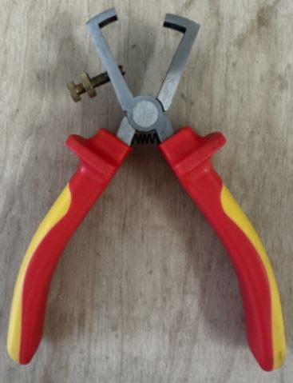 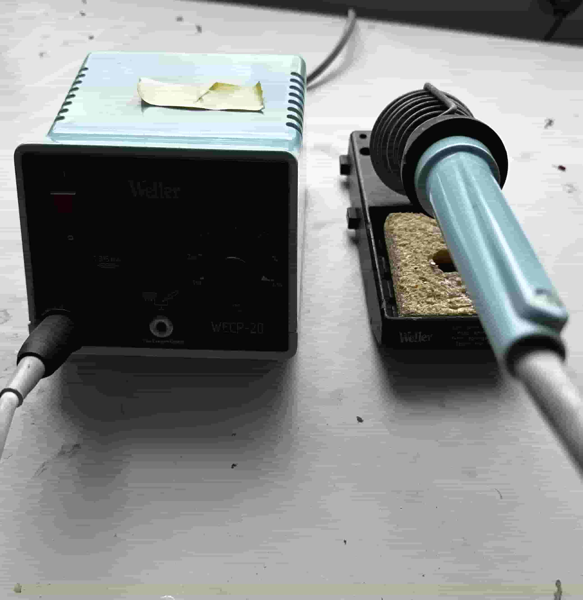 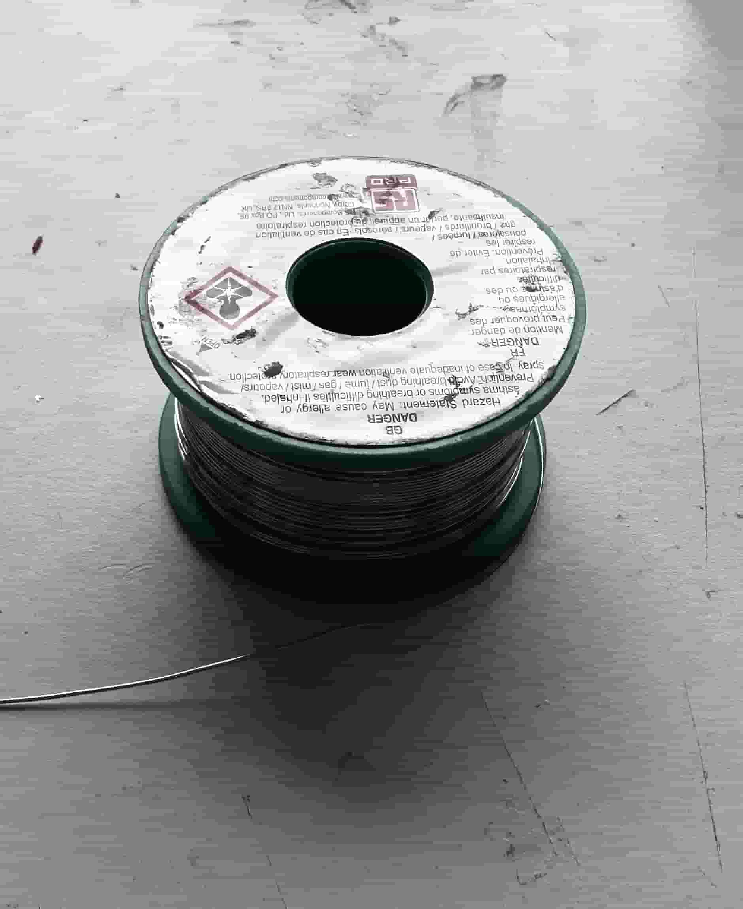

- **Pince à dénuder :** Réglable, comme sur l'image, pour différents types de câbles.
- **Fer à souder**
- **Bobine d'étain**
- **Source de chaleur pour gaine thermorétractable :** un pistolet à air chaud est l'idéal, un briquet peut faire l'affaire.
  
## **Outils nécessaires à la soudure des accumulateurs**

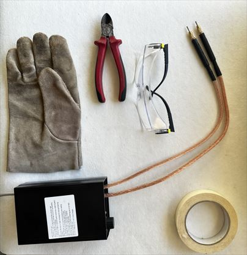

- **Gants de protection**
- **Lunettes de protection**
- **Pince à couper :** Pour découper les bandes de nickel.
- **Ruban adhésif :** Utilisé temporairement pour maintenir en place différents composants.
- **Seau de sable :** Pour étouffer un éventuel début de flamme des accumulateurs.
- **Soudeuse par points**

| Visuel | Référence | Quantité | Dénomination | Usage |Substituabilité | Tips/Conseil |
|-------|-----------|----------|--------------------------|--------------------|---------------------|----------|
||Amazon|1|[Soudeur par Points Réglable pour Batteries](https://www.amazon.fr/dp/B0DNQHWD2Q?ref_=pe_111711481_1111265561_t_fed_asin_title)||:red_circle:||

## **Composants pour 1 batterie 3S3P**

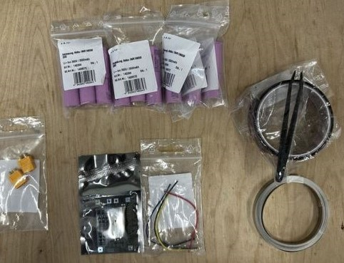

- **Deux câbles d'alimentation :** Ces câbles servent à la charge et à la décharge de la batterie. Les courants sollicités dans le projet KOSMOS n'étant pas élevés (au plus 5A), il n'y a pas besoin d'une grande section. On peut par exemple récupérer sur les chutes de cables étanches COBALT 3pin ou 4pin qui ont été raccourcis pour limiter l'encombrement dans les caissons.   
- **Connecteur XT30 femelle**
- **9 accumulateurs lithium-ion**
- **BMS** (Battery Management System)
- **4 câbles :** Reliant le BMS aux accumulateurs (respecter le code couleur)
- **Plaque de nickel en ruban**
- **Ruban adhésif kapton**
- **Gaine thermorétractable**

  
| Visuel | Référence | Quantité | Dénomination | Usage |Substituabilité | Tips/Conseil |
|-------|-----------|----------|--------------------------|--------------------|---------------------|----------|
||Conrad 1499572|9|[Pile rechargeable Li-Ion Samsung 18650](https://www.conrad.fr/fr/p/pile-rechargeable-speciale-18650-samsung-s9009316342928-resiste-aux-courants-eleves-flat-top-li-ion-3-6-v-3450-mah-1-pc-1499572.html)||:orange_circle: Récupération possible||
||Gotronic 48918|1|[Cordon JST PH femelle 4 cts JST4](https://www.gotronic.fr/art-cordon-jst-ph-femelle-4-cts-jst4-22571.htm)||:orange_circle: Récupération possible mais respecter le code couleur||
||Gotronic 48810|1|[Fiche femelle 15 A XT30U-F](https://www.gotronic.fr/art-fiche-femelle-15-a-xt30u-f.htm)||:red_circle:||
||Otronic|1|[Circuit de protection BMS 3S avec fonction d'équilibrage (OT3568)](https://www.otronic.nl/fr/circuit-de-protection-bms-3s-avec-fonction-dequili.html)||:red_circle:||
||Amazon|1|[Plaque Nickel Bande Ruban 0,15 x 8 mm](https://www.amazon.fr/Plaque-batterie-Soudure-Compatible-Soudeur/dp/B09TT4KMLB)||:red_circle:|Un ruban peut servir à faire plusieurs batteries.|
||Amazon|1|[MMOBIEL Ruban Adhésif (20mm x 30m) - Ruban Polyimide Résistant à la Chaleur ](https://www.amazon.fr/MMOBIEL-Polyimide-longueur-Antistatique-R%C3%A9sistant/dp/B07W4KWKKB)||:red_circle:|Un rouleau peut servir à faire plusieurs batteries.|

## **Composants pour les cables de recharge**

Trois éléments doivent être réalisés. Le premier est un adaptateur permettant de passer de XT30 à XT60. Il est utilisé pour recharger directement la batterie lorsqu'elle n'est pas à l'intérieur d'un caisson. Il nécessite :
- **Connecteur XT30 mâle**
- **Connecteur XT60 femelle**
- **Deux bouts de cables noir et rouge**: environ 10cm, récupérérés sur des chutes de cable étanche COBALT 3pin ou 4pin
- **Gaine thermorétractable**
  
Le second élément assure la connexion entre le XT60 et l'alimentation stabilisée. Il nécessite :
- **Connecteur XT60 mâle**
- **Deux bouts de cables noir et rouge avec leur connecteur banane**: récupérés dans un laboratoire d'électronique
- **Gaine thermorétractable**
  
Le dernier élément permet de recharger la batterie quand elle est dans le caisson étanche.
- **Connecteur XT60 femelle** 
- **Cable Cobalt 3 pin**
- **Bouchon cable cobalt**
- **Gaine thermorétractable**
  
| Visuel | Référence | Quantité | Dénomination | Usage | Substituabilité | Tips/Conseil |
|-------|------------|----------|--------------------------|--------------------|-------------------------------|----------|
||COB-1231|1|Single ended Cable 3 pin|Cable Cobalt pour la recharge de la batterie quand elle est dans la caisson étanche|:red_circle:||
||COB-1003|1|Cobalt Series Dummy Cap|Bouchon pour ce cable de recharge|:red_circle:||
||Gotronic 48811|1|[Fiche mâle 15 A XT30U-M](https://www.gotronic.fr/art-fiche-male-15-a-xt30u-m.htm)||:red_circle:||
||Gotronic 49285|2|[Fiche femelle 30 A XT60-F](https://www.gotronic.fr/art-fiche-alim--f-xt60-47680.htm)||:red_circle:||
||Gotronic 49289|1|[Embase mâle 30 A XT60M](https://www.gotronic.fr/art-embase-male-30-a-xt60m-39057.htm)||:red_circle:||

# **Assemblage de la batterie**

## **⚠️ Attention:**

**À cette étape de la conception de notre système, certaines parties présentent des risques. Il est donc essentiel de rester vigilant et de respecter scrupuleusement les mesures de protection recommandées.**

## **Vue d'ensemble de la partie batterie**

La batterie se compose des 9 accumulateurs connectés au module BMS selon un schéma spécifique. Le seul connecteur externe est un XT30, utilisé à la fois pour la charge et la décharge. À noter que la couleur des fils doit être respectée.

|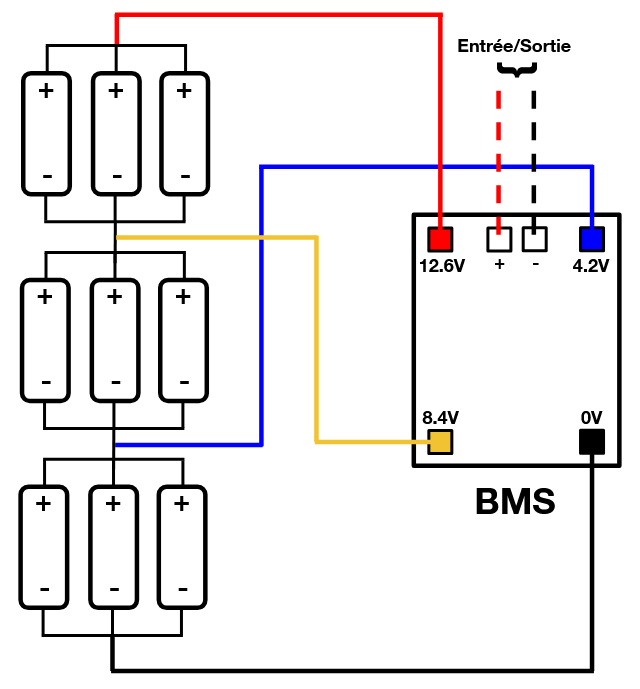|
|:--:|
|*Schéma de branchement*|

### **Connecteur XT30**

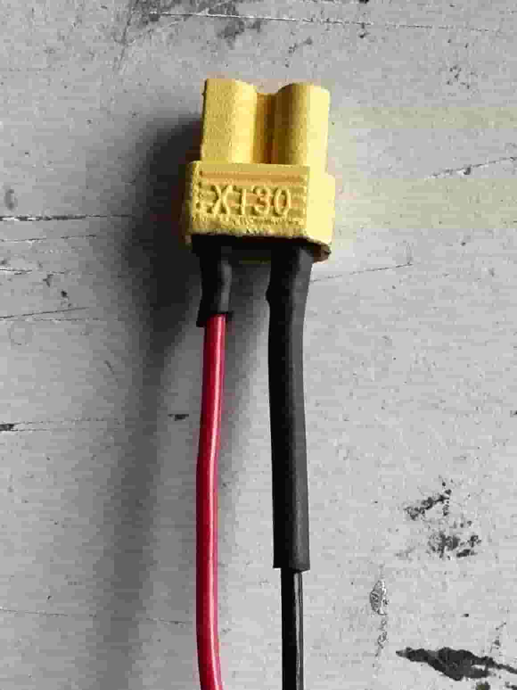

Les deux câbles d'alimentation doivent être légerement étamés puis soudés sur le connecteur XT30 femelle, en respectant les couleurs et les signes, le rouge sur le **+** et le noir sur le **-**. Ne pas oublier les gaines thermorétractables, à chauffer avec un décapeur thermique, briquet ou fer à souder, attention cependant à ne pas l'abîmer en chauffant trop.

---

Après avoir préparé le connecteur XT30, il faut maintenant raccorder les deux câbles au module BMS.

Commencez par dénuder légèrement les extrémités des câbles.

**⚠️ Attention à ne pas trop dénuder : une trop grande longueur de fil nu augmente le risque de contact entre les deux pôles, ce qui pourrait provoquer un court-circuit.**

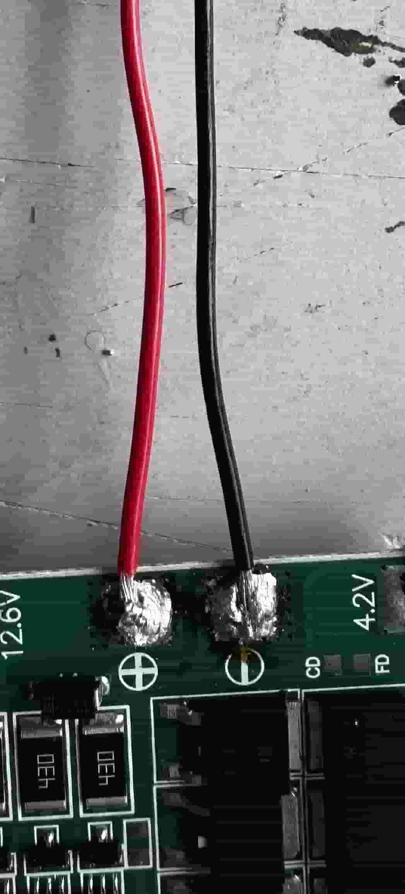

Comme pour le connecteur XT30, attention à bien respecter le signe pour chaque câble.

### **Assemblage des Accumulateurs**

Avant de commencer, assurez-vous que la soudeuse par points est bien chargée et opérationnelle.

|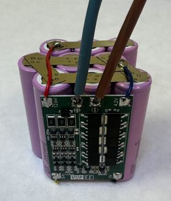|
|:--:|
| *Résultat à la fin de l'assemblage (avec un autre type de câbles)* |

**⚠️ Attention: Les accumulateurs lithium-ion sont sensibles à la manipulation. Un court-circuit peut provoquer un départ de feu. Il est donc essentiel de réduire les risques au maximum.**

---

#### Préparation de la zone de travail

Avant toute opération, sécurisez l'environnement :

- Éloignez tout produit inflammable.
- Préparez un seau de sable à portée de main (en cas d'incident).
- Équipez-vous de gants et de lunettes de protection.

---

#### Assemblage des accumulateurs

- Formez trois groupes de trois accumulateurs. Chaque groupe représente une chaîne de trois accumulateurs en parallèle, ce qui est un modèle 3S3P (3 en série et 3 en parallèle).
- Chaque groupe est constitué de trois accumulateurs alignés dans le même sens : le pôle positif (bombé) d'un côté, et le pôle négatif (plat) de l'autre.
- Disposez chaque groupe en quinconce, comme montré sur l'image ci-dessous.

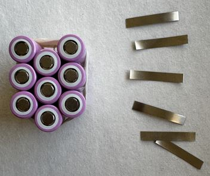

- Utilisez du ruban adhésif pour maintenir temporairement chaque groupe en place. Cela facilite la soudure et évite les mouvements indésirables.
- Découpez une bande de nickel pour chaque groupe afin de relier les trois pôles entre eux.

---

#### Soudure par points

- Soudez les bandes de nickel en appliquant quatre points de soudure par pôle, en formant un motif en diagonale pour une bonne répartition.

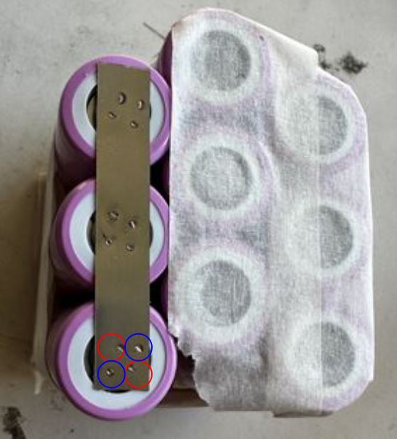

- Répétez cette opération jusqu'à ce que chaque pôle de chaque groupe soit correctement connecté à sa bande de nickel. Cela nécessite 6 bandes en tout (3 groupes avec 2 côtés).

---

#### Assemblage final des blocs

Vous avez maintenant trois blocs de trois accumulateurs chacun. Avant de les assembler entre eux, il est nécessaire d'inverser l'orientation du bloc central, c'est essentiel pour respecter le schéma de connexion en série, où les pôles opposés se connectent entre eux (le + d'un bloc vers le - du bloc suivant), tout en respectant la configuration 3S3P.

- Découpez 4 bandes supplémentaires de nickel pour relier les blocs entre eux, selon le schéma.

- Rappel : le pôle positif est le côté bombé, et le pôle négatif est le côté plat.

Enfin, vous obtiendrez un ensemble de blocs soudés comme ci-dessous. Les couleurs correspondent aux futures connexions du BMS.

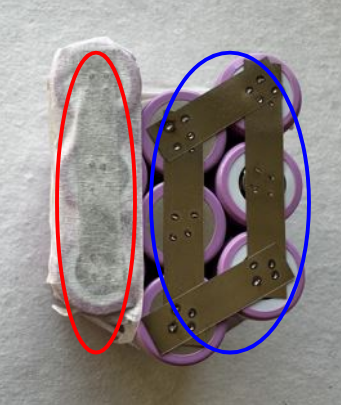

---

### Connexion entre le BMS et les accumulateurs

Une fois les blocs soudés entre eux, on peut passer à l'étape du câblage entre le BMS et les accumulateurs.

Pour cela, vous aurez besoin de :

- 4 câbles (de couleurs différentes, comme sur le schéma)
- 4 petits carrés de plaque de nickel

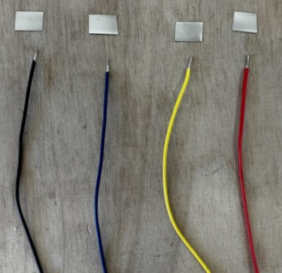

Commencez par souder chaque câble sur un carré de nickel, à l'étain.

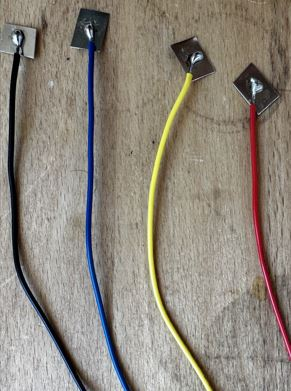

---

#### Détermination de la longueur des câbles

Pour déterminer la longueur idéale des câbles, fixez temporairement le BMS sur le côté des accumulateurs avec un morceau de ruban adhésif. Cela vous permet de positionner les câbles avec précision.

Ensuite :

- Repérez et marquez la bonne longueur.
- Coupez les câbles en conséquence.
- Dénudez-les légèrement.
- Soudez-les sur les bornes du BMS, en respectant les couleurs et l'ordre indiqués dans le schéma de câblage.

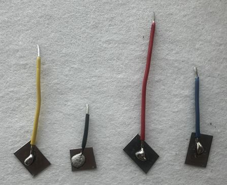 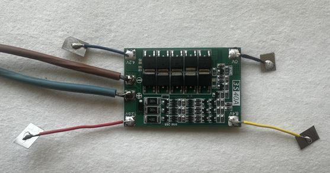

---

#### Connexion finale à la batterie

Il est temps de souder les extrémités libres des câbles sur les zones correspondantes des accumulateurs. Encore une fois, vous pouvez fixer temporairement le BMS avec du ruban pour faciliter le positionnement.

 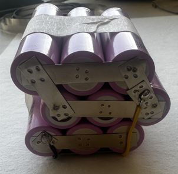

---

### Vérification du montage

Avant de finaliser, prenez un multimètre et mesurez la tension entre les bornes + et - de la batterie. Si vous lisez une tension cohérente (autour de 10-12V selon l'état de charge), c'est que tout est correctement câblé.

---

### Finition

Retirez le ruban temporaire et enveloppez l'ensemble de la batterie avec du ruban adhésif kapton pour la protéger et maintenir l'assemblage.

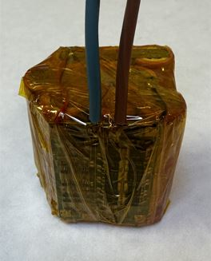

## **Réalisation des cables de recharge**
