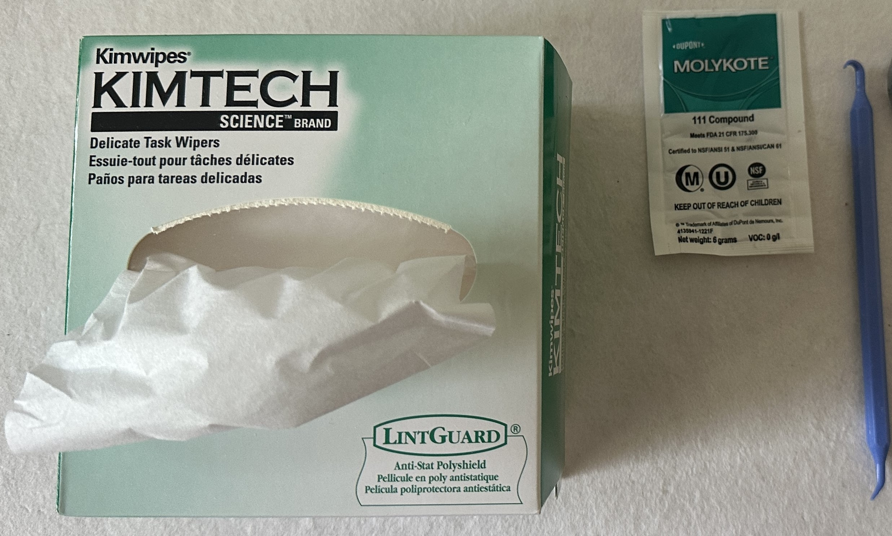
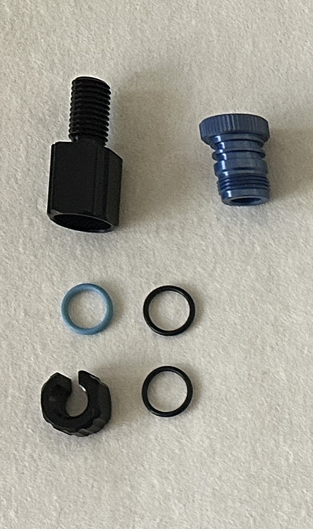
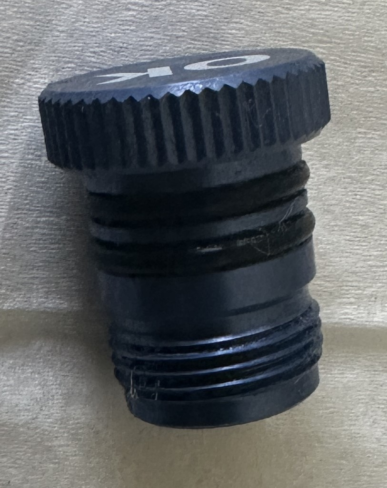
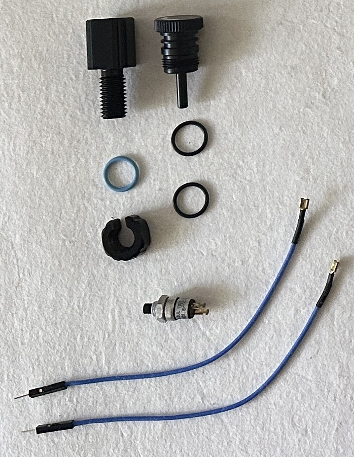
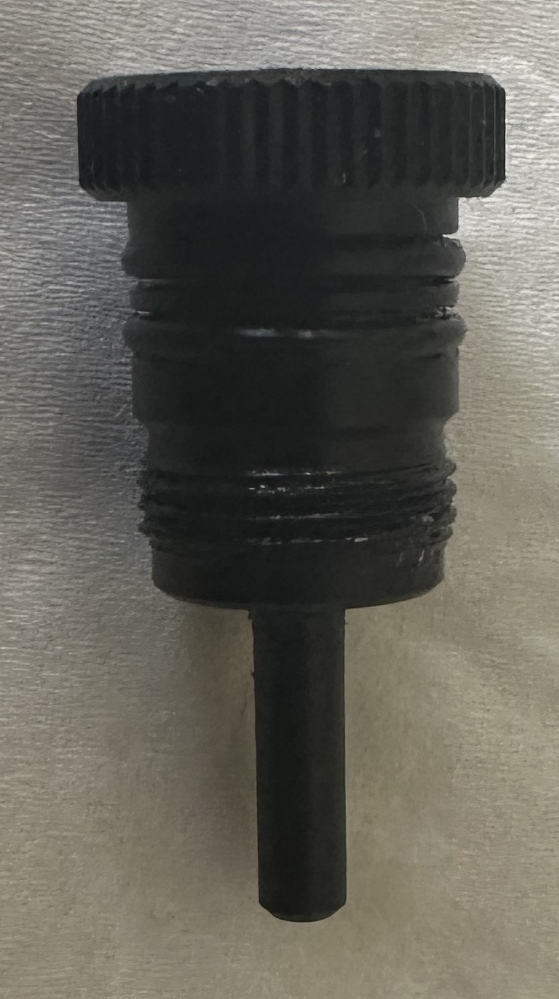

# **Outils**

- **O-Ring pick** 
- **Graisse Molykotte** fournie avec les flanges BlueRobotics
- **Papier Kimtech**
  
## **Purge**

- Graisser les 2 joints toriques les plus fins et les insérer sur le bouchon à l'aide du l'O-Ring pick.

## **Switch**

- Graisser les 2 joints toriques les plus fins et les insérer sur le bouchon à l'aide du l'O-Ring pick.

## **Bouchon**

