# Procédure de récupération des données 

## Configuration du PC windows

Étape 1 : Accéder aux Propriétés Réseau
- Faire un clique droit sur l'cône réseau de la barre de tâches puis `Ouvrir les paramètres réseau et Internet`

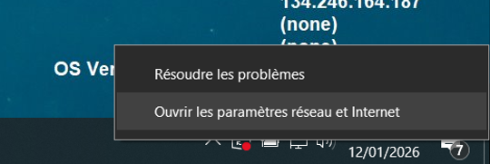

- Dans `Paramètres réseau avancés` cliquer sur `Modifier les options d'adaptateur`

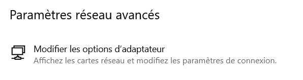

- Localisez votre adaptateur Ethernet, faire un clique droit dessus, puis `Propriétés`.

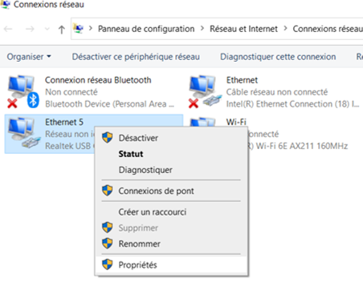

- Double-cliquer sur `Protocole Internet version 4 (TCP/IPv4)`

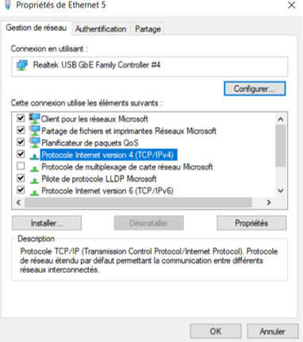
  
- Changez le mode d'attribution d'IP Automatique (DHCP) vers pour la définir manuellement.
- Remplissez le champ `Adresse IP` avec 192.168.10.1
- Remplissez le champ `Masque de sous-réseau` (Subnet mask) avec 255.255.255.0
- Passerelle (Gateway) : laisser vide
- DNS préféré (Preferred DNS) : laisser vide
- Cliquez sur `OK`

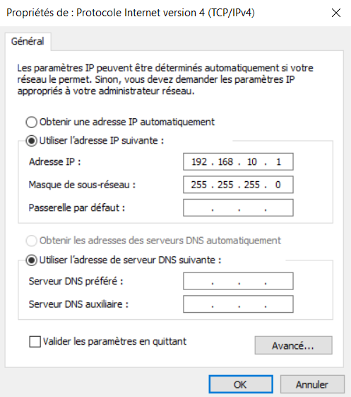

## Téléchargement à partir du logiciel KOSMOS

# Procédure de mise au point de la caméra

Cette section a pour vocation d'expliciter la méthode pour faire la mise au point de la caméra, que ce soit juste après la réalisation du caisson ou lors d'une maintenance. Pour cette opération il faudra :
- un ordinateur portable avec RealVNC
- un écran et son cable micro HDMI (pour se raccorder à la RPi)
- une alimentation Raspberry Pi 
- une mire, que l'on pourra imprimer en A3 à partir du [pdf](Mire-A3-65mm-5x3.pdf).  

- la caisson caméra débranché de la batterie et du moteur dont on aura enlevé le tube

## Nettoyage des optiques

- Dévisser l'objectif Edmund et nettoyer toutes les surfaces avec un chiffon microfibre
- Regarder le capteur pour vérifier si des poussières sont présentes. Les chasser avec de l'air sec si certaines sont visibles. ATTENTION, ne pas toucher le capteur ! ni souffler dessus avec la bouche (risque de projections) !
- Remonter l'objectif Edmund sur le capteur.

## Démarrage de la RPi et connexion VNC

- Brancher l'écran à la Raspberry Pi.
- Brancher le cable d'alimentation. Attendre que la RPi soit démarrée.
- Sur l'ordinateur portable, se connecter au WiFi généré par le KOSMOS. 
- Ouvrir un navigateur et taper `10.42.0.1` pour avoir accès à l'interface web.
- Modifier le paramètre `06_shutdown` pour le mettre à `0` et effectuer un `Reboot`.
- Aller ensuite dans la page `Camera` et arrêter le logiciel embarqué KOSMOS en appuyant sur `Shutdown`. (Cette manipulation permet d'arrêter le script KOSMOS sans éteindre la Rpi. La caméra peut ainsi être utilisée.)
- Sur l'ordinateur portable, ouvrir RealVNC et se connecter à l'adresse `10.42.0.1`.

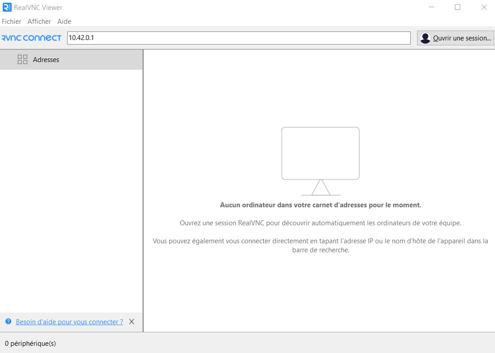

- Cliquer sur `Continuer`  si un message d'erreur apparaît puis rentrer les identifiants de connexion. (Normalement id: `kosmos` et mdp: `kosmos`)

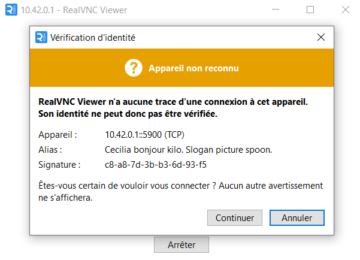 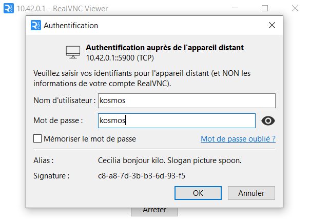

## Mise au point
- Ouvrir un terminal et taper :  
```
cd kosmos_software
python3 kosmosCamFocus.py
```
- Deux fenêtres apparaissent. Agrandir l'image qui correspond au champ de vue de la caméra.

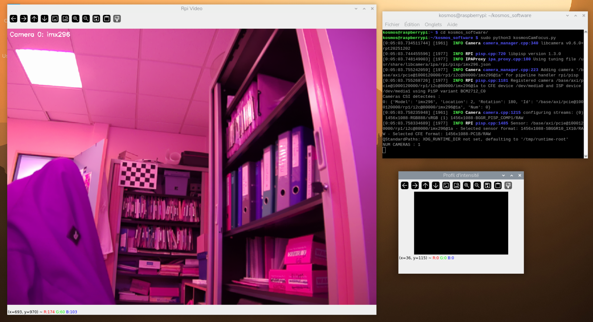

- Placer une mire à 7.5 m de la caméra.
- Ouvrir à fond l'objectif, c'est-à-dire mettre le petit point blanc devant 1.8. (On a alors avoir une profondeur de champ minimale.)

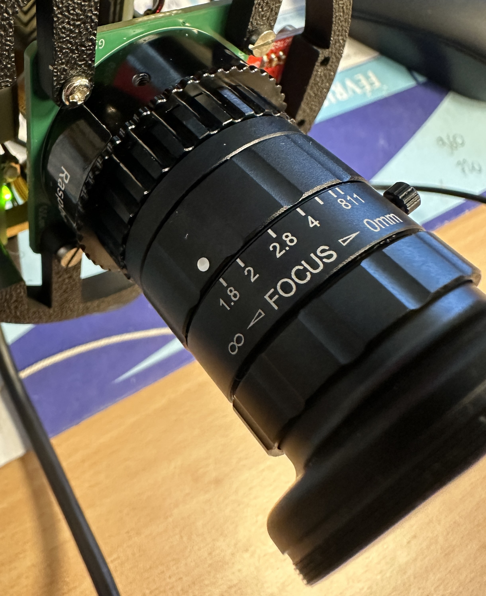

- Sur la fenêtre de la caméra, cliquer pour tracer un trait de part et d'autre du damier. On pourra zoomer sur la mire grâce à la molette de la souris.
- Réaliser le focus sur la mire avec la bague en essayant d'avoir les bords les plus francs possible.

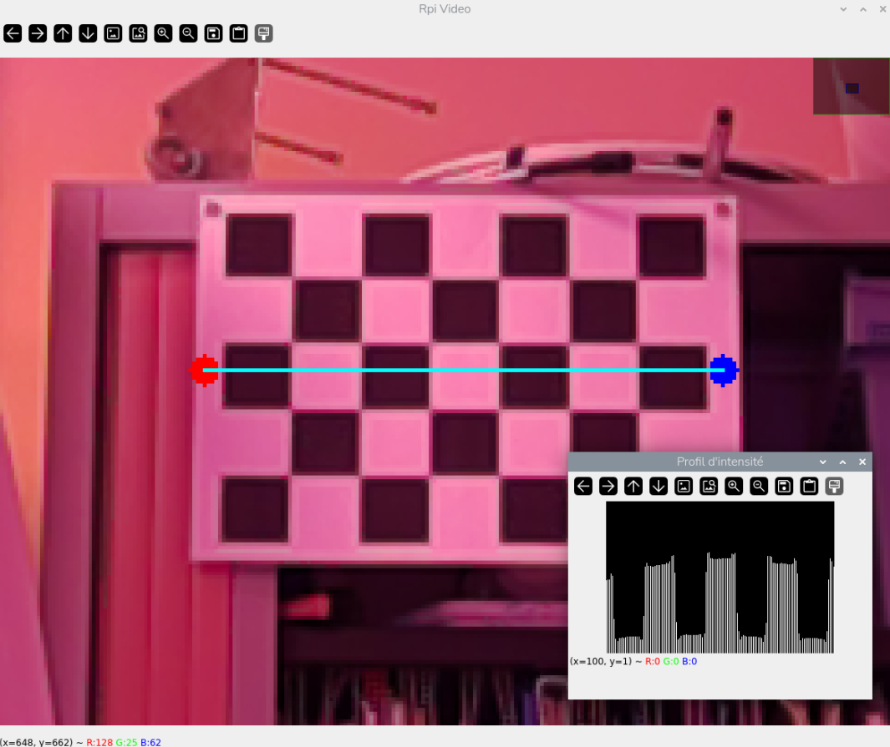 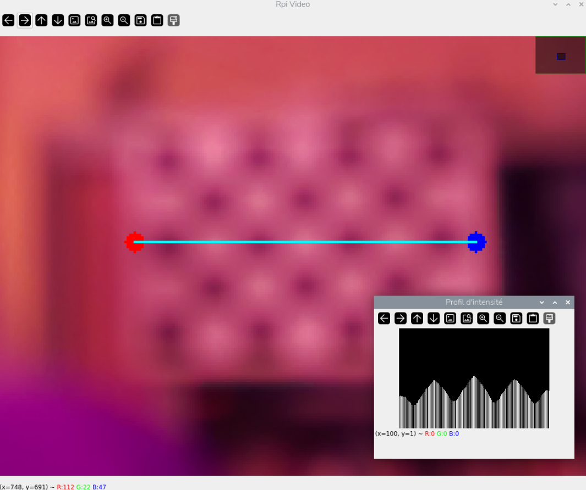

- Bloquer la bague de focus solidement à l'aide de la petite vis.
- Fermer enfin l'objectif à moitié (le petit point blanc sur 2.8) pour récupérer une meilleure profondeur de champ. Bloquer la bague d'ouverture dans cette position. Vérifier que le focus est toujours bon (le fait de serrer les bagues peut parfois les faire bouger.)

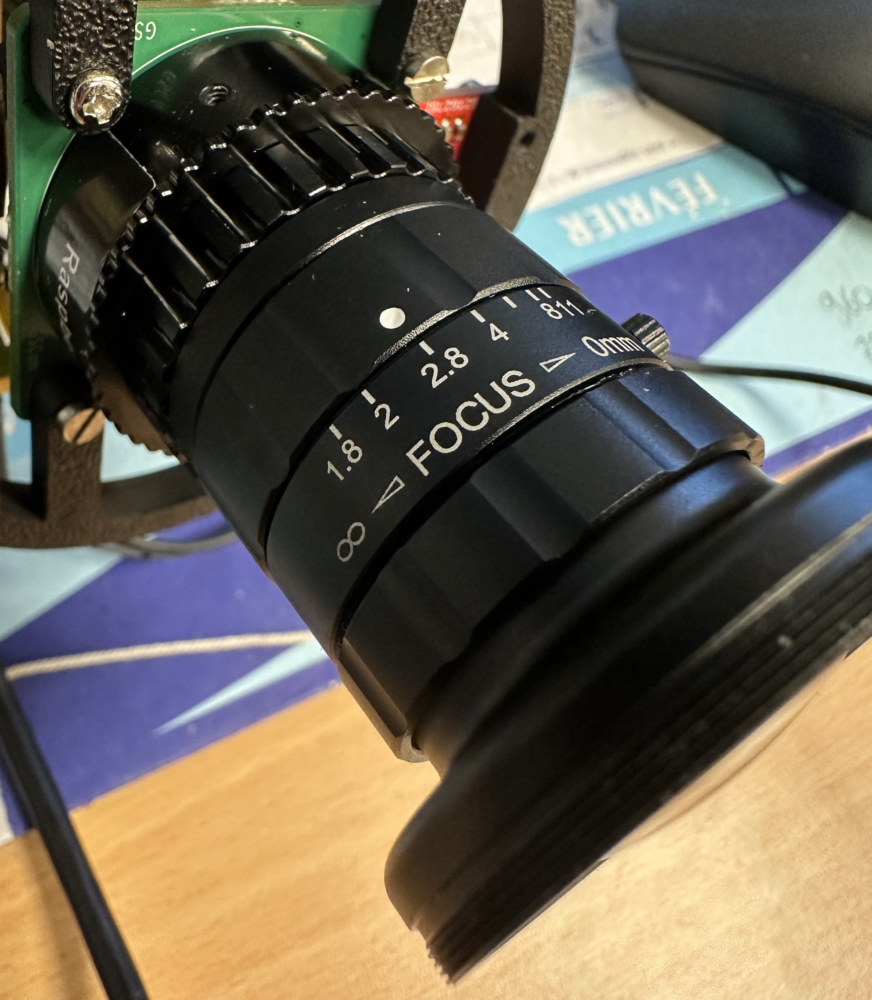

  
- (Effectuer éventuellement cette opération sur la deuxième caméra (mode stéréo), en basculantde vue grâce au curseur en bas de la fenêtre vidéo.)

## Fin de la procédure
- Quitter l'interface de mise au point en fermant la console.
- Redémarrer la Raspberry Pi. Le soft kosmos va se remettre en route.
- Se reconnecter au Wifi de la Rpi, aller à 10.42.0.1 et remettre le paramètre  `06_shutdown` sur 1. Effectuer un `Reboot` puis éteindre le système avec un `Shutdown`.
- La mise au point est effectuée. Déconnecter l'écran et l'alimentation de la RPi et remettre le tube.

# Procédure de mise-à-jour du logiciel

Cette section décrit la procédure pour mettre à jour le logiciel KOSMOS. Pour ce faire, on aura besoin de :
- un cable de transfert de données
- un ordinateur portable avec RealVNC
  
On notera qu'il n'est pas nécessaire de démonter le système pour effectuer cette màj.

- Brancher le cable de récupération de données au caisson vidéo et à une prise internet.
- Démarrer le système Kosmos, en branchant le shunt de fonctionnement sur le caisson batterie.
- Sur l'ordinateur portable, se connecter au WiFi généré par le KOSMOS.
- Avec RealVNC, se connecter au `10.42.0.1`
- Ouvrir un terminal et taper :  
```
cd kosmos_software
sh InternetActif.sh
```
Cette opération a pour but de rétablir l'accès à Internet qui était désactivé pour le transfert de données via le port ethernet.
- Effectuer la mise à jour du logiciel en tapant dans le terminal :
```
git pull
```
- On peut désormais remettre en fonction le transfert de données. Pour ce faire, taper dans le terminal :
```
sh TransfertDonneesActif.sh
```
- Eteindre finalement la Raspberry.
