# Caisson batterie

## Vues générales

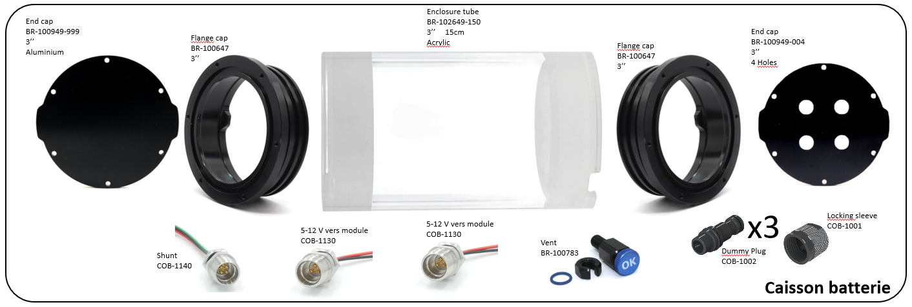

## Réalisation de la batterie

On suivra le [tutoriel dédié](../../CommonElements/doc/01_batterie.md) à la fabrication de batterie. Il faudra néanmoins opérer deux modifications mineures :

- ne pas souder le connecteur XT60 sur les cables masse et 12V sortant du BMS
- souder ces deux cables avec un angle de 45 degrés comme la photo qui suit :

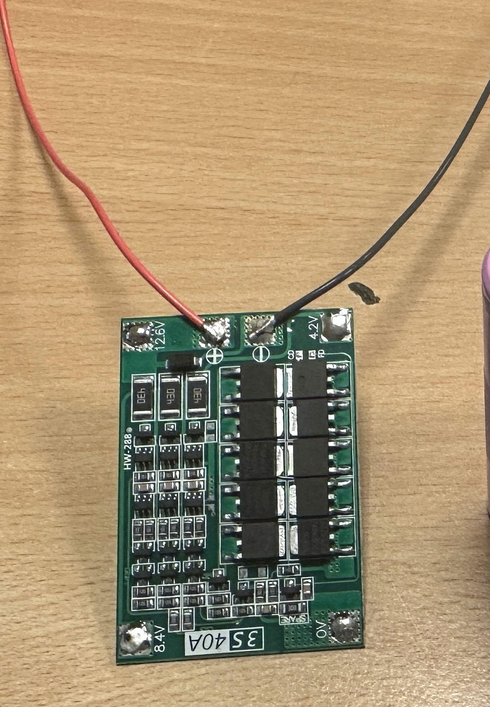 

- Ces cables doivent mesurer une dizaine de centimètres. On leur sertira des ferrules à leur extrémité.

## Assemblage

### Flanges

- Assembler la "flange" avec le "end cap" en alumium (sans trous) en suivant le [tutoriel dédié](../../CommonElements/doc/02_flanges.md).  
- Fixer les deux connecteurs COB-1130, le connecteur COB-1140 et la purge sur le "end cap" 4 trous sur suivant le [tutoriel dédié](../../CommonElements/doc/03_etancheitedivers.md). On respectera l'emplacement de chaque élément de la figure suivante.

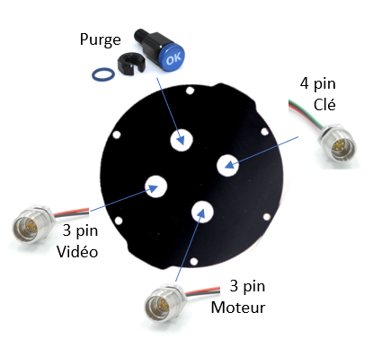 

### Connectiques 5V
AVANT DE REALISER LES ETAPES SUIVANTES, S'ASSURER QUE LES CONNECTEURS SONT BIEN PASSES PAR LES TROUS DU "END CAP".

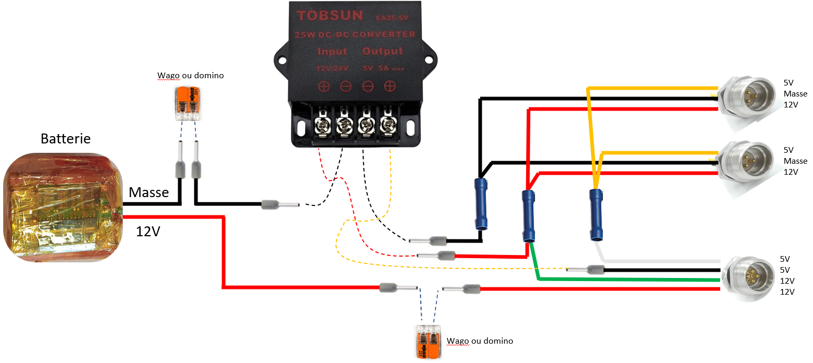 

- Couper les fils jaunes des COB-1130 et le fil blanc du COB-1140 à 6 cm puis les dénuder sur 1 cm.
- Sertir ces trois fils dans une cosse BV2. (On pourra tresser entre eux les deux fils qui rentreront du même côté de la cosse).
- Plaquer la cosse et les fils au plus proche du "end cap".

### Connectiques masse
- Couper les deux fils noir des COB-1130 à 6 cm et les dénuder sur 1 cm.
- Conserver une chute de ces fils de 10 cm et la dénuder des deux côtés sur 1 cm.
- Sertir ces trois fils noirs dans une cosse BV2. (On pourra tresser entre eux les deux fils qui rentreront du même côté de la cosse).
- Plaquer la cosse et les fils au plus proche du "end cap".
- Sur l'extrémité restante, sertir une ferrule en prenant soin de choisir le diamètre adapté.
- A l'aide d'une pince coupante, raccourcir cette ferule de 1 mm.

### Connectiques 12V

- Couper les fils rouges des COB-1130 et le fil vert du COB-1140 à 6 cm puis les dénuder sur 1 cm.
- Conserver une chute de fil rouge de 10 cm et la dénuder des deux côtés sur 1 cm.
- Sertir les trois fils rouges et le fil vert dans une cosse BV2. (Deux de chaque côté qu'on tressera ensemble).
- Plaquer la cosse et les fils au plus proche du "end cap".
- Sur l'extrémité restante du fil rouge, sertir une ferrule en prenant soin de choisir le diamètre adapté.
- A l'aide d'une pince coupante, raccourcir la ferule de 1 mm.

### Deux dernièrs cables venant du COB-1140

- Raccourcir de moitié les deux cables restants du COB-1140 (rouge et noir) et les dénuder sur 1 cm.
- Sertir une férule sur chacun d'entre eux.
- A l'aide d'une pince coupante, raccourcir la ferule du cable noir de 1 mm.

### Un dernier cable noir entre la batterie et le convertisseur (via un wago)

- Dénuder sur 1 centimètre les deux côtés d'un fil noir de 10 cm.

- Sertir des ferrules à chacune des extrémités.
  
### Imprimer la structure interne

 

### Fixation du convertisseur 5V-12V

- Préparer les pas de vis des trous de fixation en vissant un boulon en métal de diamètre 2.5 mm dans les quatre trous qui servent à maintenir le convertisseur.
- Installer le convertisseur à sa place et visser les quatre boulons de diamètre 2.5 mm et de longueur 8 mm. Ces boulons ne doivent pas dépasser du côté de la batterie. Rajouter au pire des rondelles (ou des écrous).

### Installation de la batterie

ATTENTION, LES CABLES PROVENANT DE LA BATTERIE NE DOIVENT JAMAIS SE TOUCHER.
- Faire passer les fils de la batterie sous le convertisseur.
- Installer la batterie dans son compartiment puis la fixer avec un rilsan. L'élément de serrage doit être situé sur le dessus de la batterie.
- Couper le cable rouge de la batterie à 10 cm et le sertir avec une ferule.
- Couper le cable noir de la batterie à 10 cm et le sertir avec une ferule. On la raccourira de 1 mm à l'aide d'une pince coupante.
- Fixer cette ferule (du cable noir) dans la borne - du 12 V du convertisseur.

###

- Assembler le "end cap" 4 trous avec son "flange" en suivant le [tutoriel dédié](../../CommonElements/doc/02_flanges.md).
- Fixer la ferule du cable noir "masse" sur la borne - du 5 V du convertisseur.
- Fixer la ferule rouge 12 V sur la borne + du 12 V du convertisseur.
- Fixer la ferule du cable noir "5V" (provenant du COB-1140) sur la borne + du 5V du convertisseur.
- Dégager le cable rouge 12V. Il sera raccordé en tout dernier lieu au 12 V rouge de la batterie avec un Wago ou un domino.  
- Fixer l'ensembe "end cap + flange" sur la structure interne imprimée en 3D grâce à trois boulons 3 mm.
- Connecter les deux cables 12V grâce à un Wago ou un domino et tasser ces éléments sur un côté du convertisseur.

## Shunt de fonctionnement

## Elements pour la recharge

### Shunt de charge

- Raccourcir le cable COB-1241 pour qu'il mesure une vingtaine de centimètres.
- A l'aide du knipex, enlever 3 cm de gaine noire.
- Couper à ras de la gaine noire le fil noir. Couper également le fil blanc pour qu'il n'en reste que 1 cm.
- Enfin, comme ce cable ne servira qu'à terre, ôter son joint à l'aide de l'O-ring pick.
 
 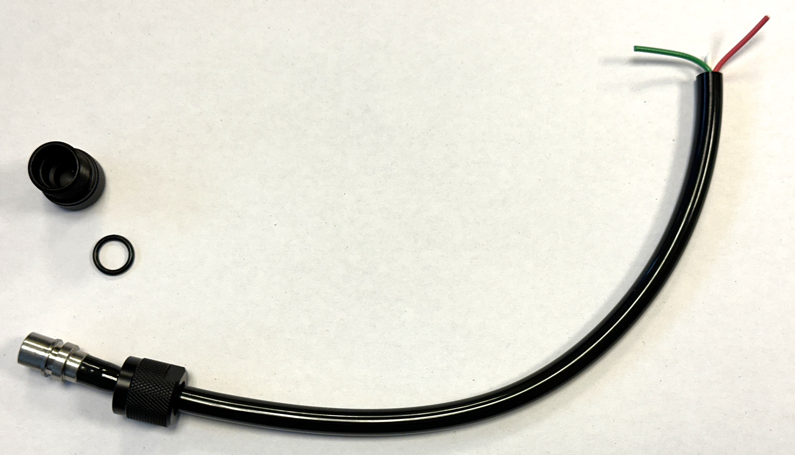

- Mettre une gaine thermo-rétractable sur le fil blanc, de sorte à isoler ce contact.
- Dénuder les fils rouge et vert sur un demi-centimètre et les souder ensemble.

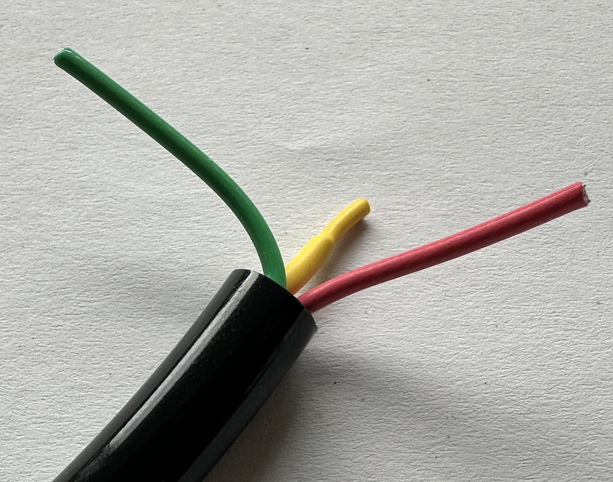 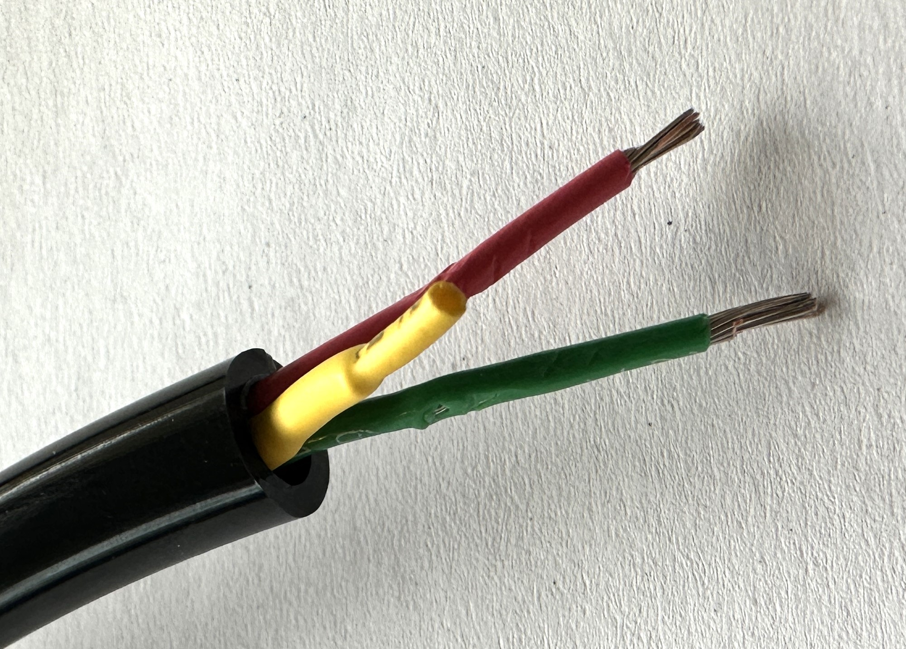 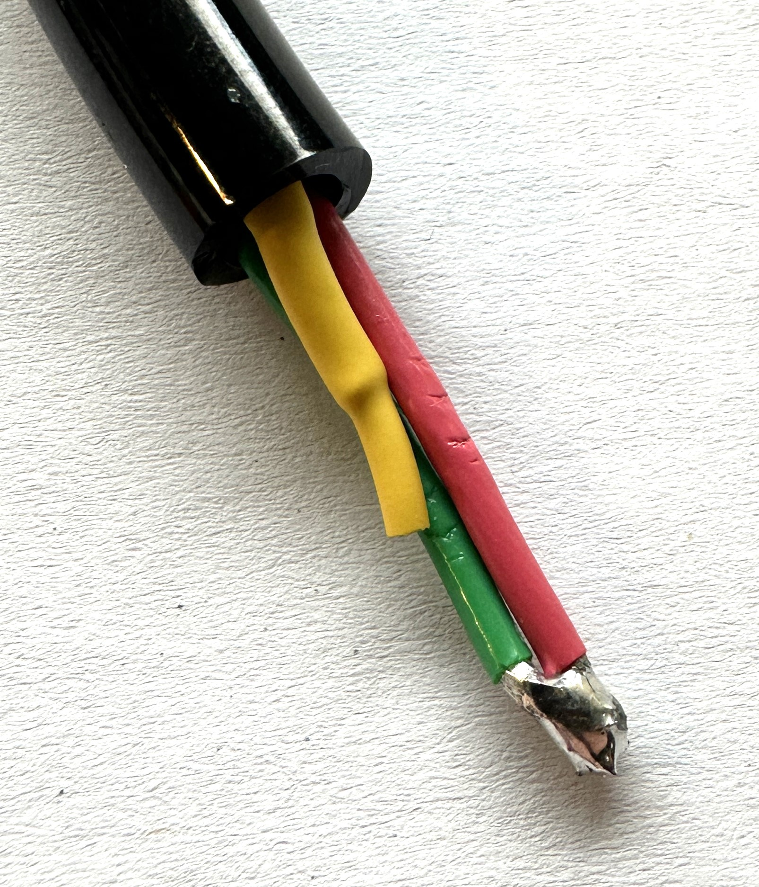

- Mettre une gaine thermo-rétractable sur tous les fils. On essaiera de la faire rentrer dans la gaine noire.
- Glisser enfin un gaine thermo-rétractable sur laquelle on aura écrit "SHUNT CHARGE" sur la gaine noire.

 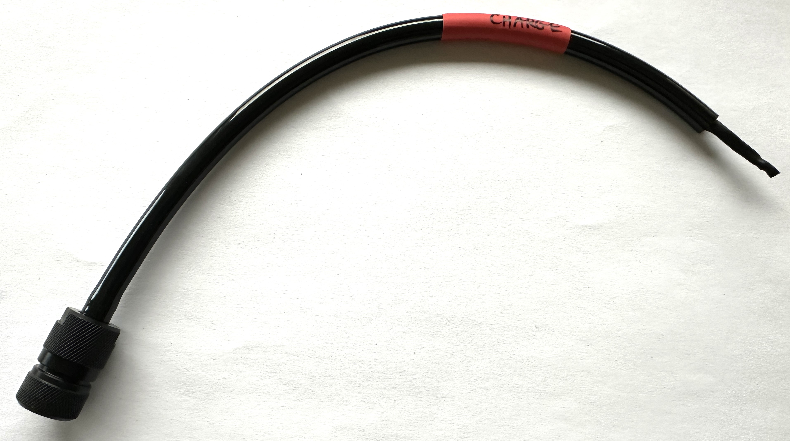

### Cable de recharge (partie 1)

- Avec l'outil Knipex, enlever 4 cm de gaine noire sur le cable COB-1231. Attention à ne pas abimer les fils à l'intérieur. (Si c'était le cas, glisser de la gaine thermoretractable au niveau de la coupure.)
- Enfiler 5 cm de gaine thermoretractable sur la gaine noire
- Couper à ras de la gaine noire le fil jaune. Dénuder les fils rouge et noir sur 5 mm.
- Enfiler un morceau de gaine thermoretractable de 2 cm sur chacun de ces deux fils en choississant leur diamètre afin qu'il puisse recouvrir la cosse du connecteur XT60 femelle.
- Souder les fils rouge et noir sur le connecteur XT60 en respectant les polarités : + sur rouge et - sur noir.
- Faire glisser les gaines thermoretractables et les chauffer.
- Remonter la gaine thermorétractable et la chauffer. 

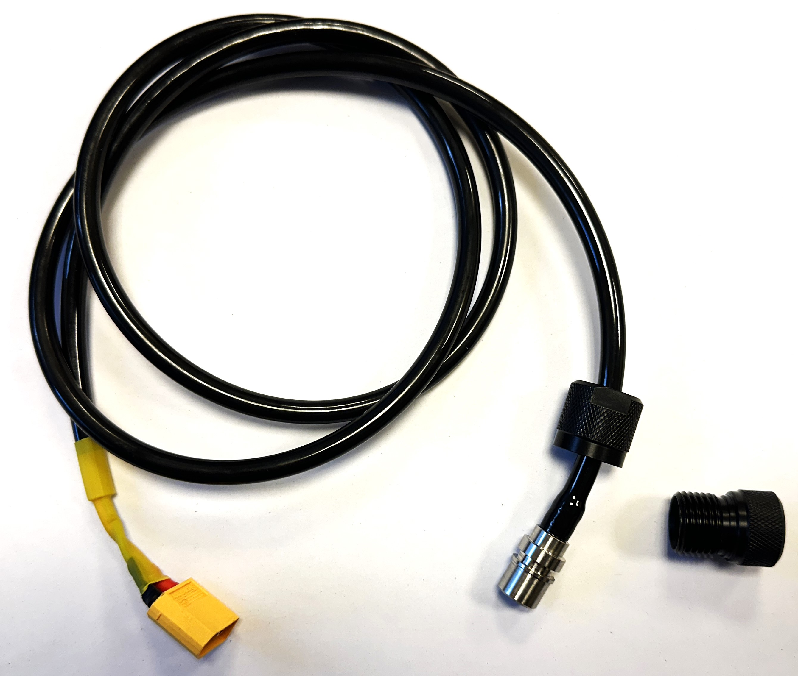 

- Comme ce cable n'a pas vocation à aller sous l'eau, on enlevera le joint de connecteur avec l'outil O-Ring Pick pour faciliter son insertion sur le caisson.

### Cable de recharge (partie 2) 

- Souder deux cables rouge et noir de 10 cm (récup', comme ceux des multimètres) sur un connecteur XT60 mâle en respectant la polarité.
- De l'autre côté, dénuder ces cables sur 3mmn, les étamer et les souquer dans le connecteur femelle fourni avec le chargeur. 

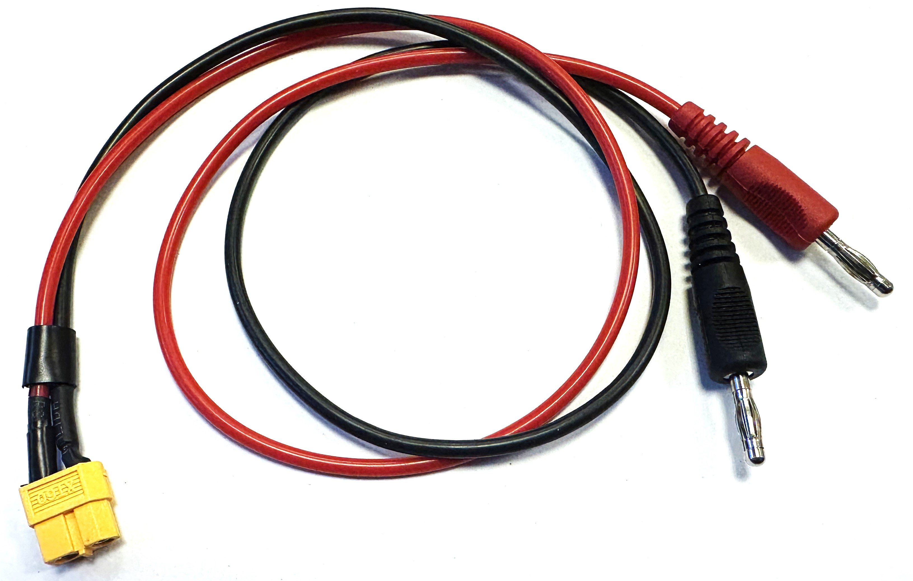 
