## Caisson Moteur

### Vue générale

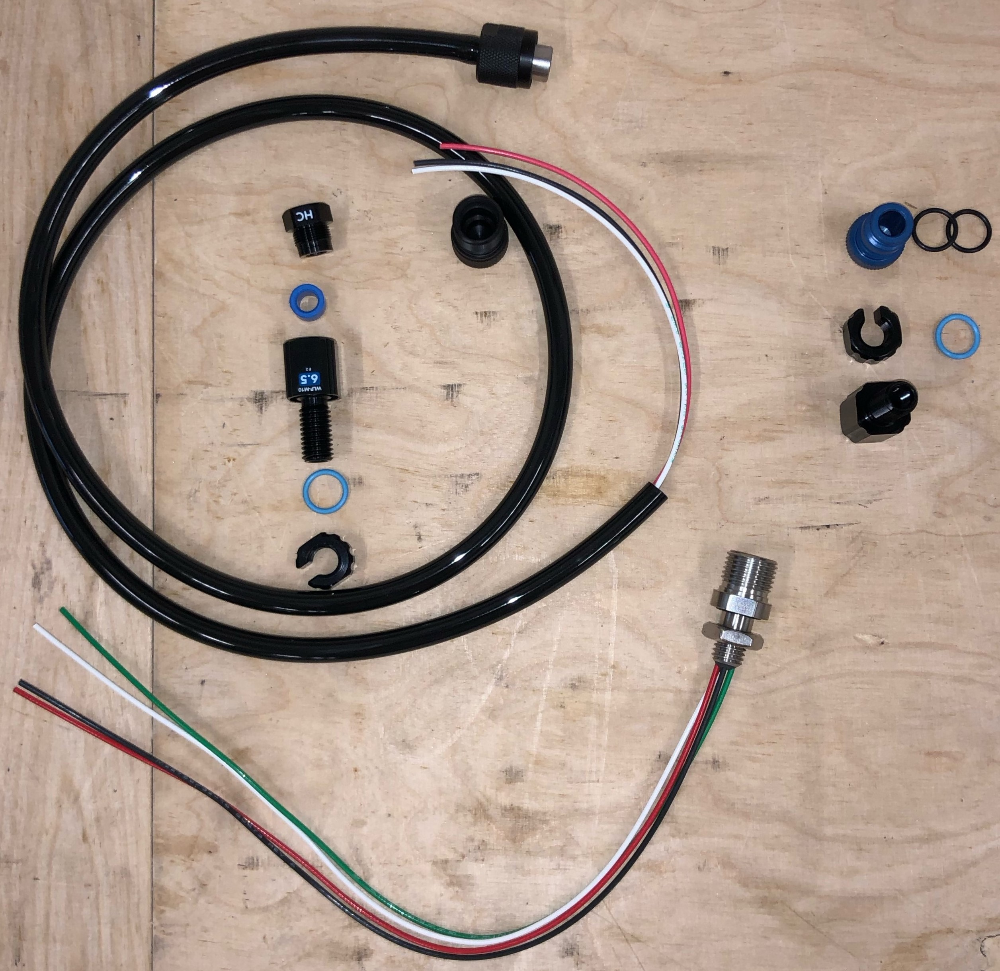

### Réalisation de la carte électronique du moteur

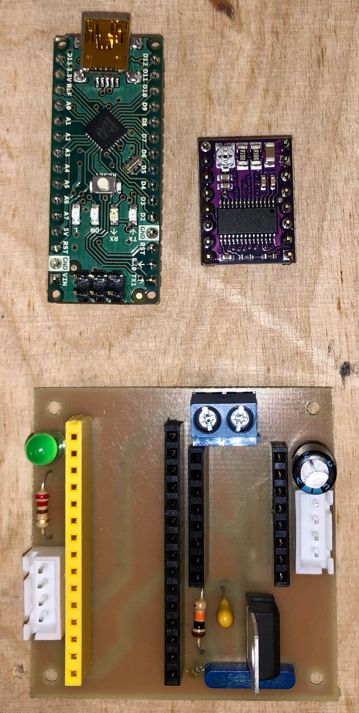 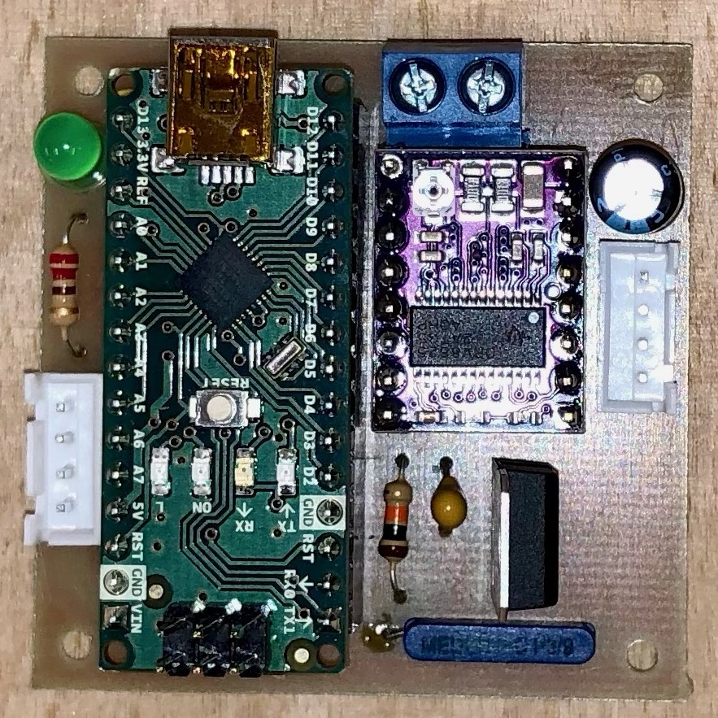

### Cablage moteur

- Raccourcir les cables du moteur pour qu'ils mesurent 10 cm.
- Dénuder les fils sur 5 mm puis y sertir des cosses JST. Vérifier qu'elles tiennent fermement.
- Insérer les cosses dans les connecteurs JST en suivant le plan de cablage.

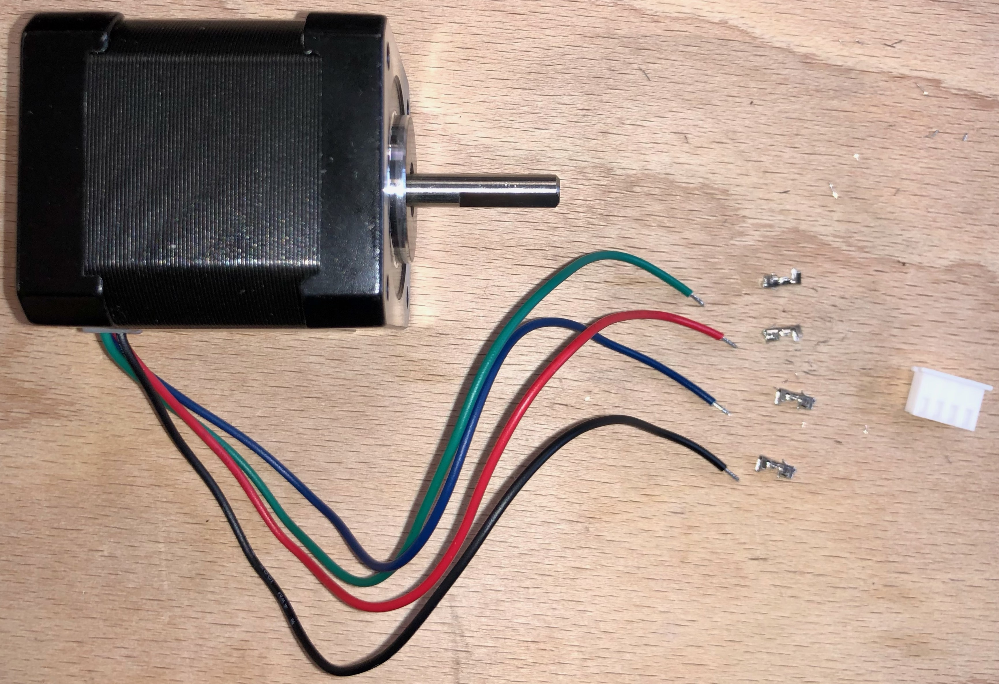 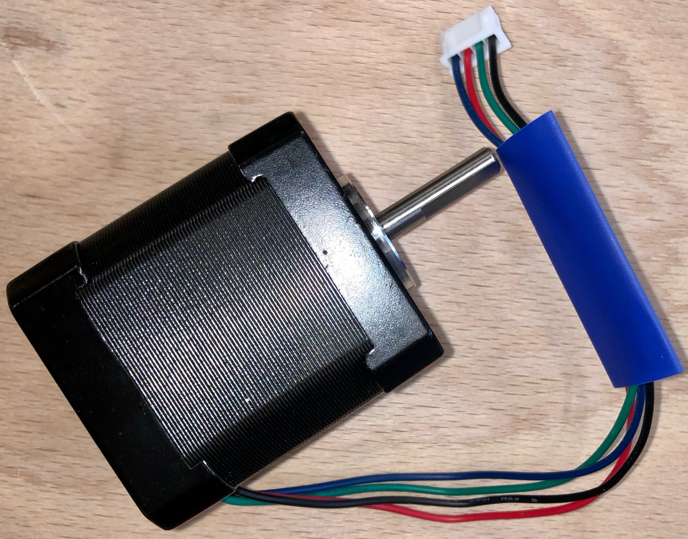

### Réalisation du cable d'alimentation

- Avec une pince coupante, raccourcir le cable COB-123P1 pour qu'il mesure 40 cm. Garder les fils noir, blanc et rouge. La gaine ne sera plus utilisée.
- Avec un cutter, enlever 10 cm de gaine noire. Attention à ne pas abimer les fils à l'intérieur. (Si c'était le cas glisser de la gaine thermoretractable au niveau de la coupure.)
- Couper le fil blanc à ras de la gaine pour ne conserver que le noir et le rouge. (On rappelle la convention : 5V Blanc et Noir. 12 V Rouge et Noir.)
- Dénuder les fils rouge et noir sur 7 mm.
- Y sertir des cosses dont on a vérifié qu'elles avaient le diamètre optimal.

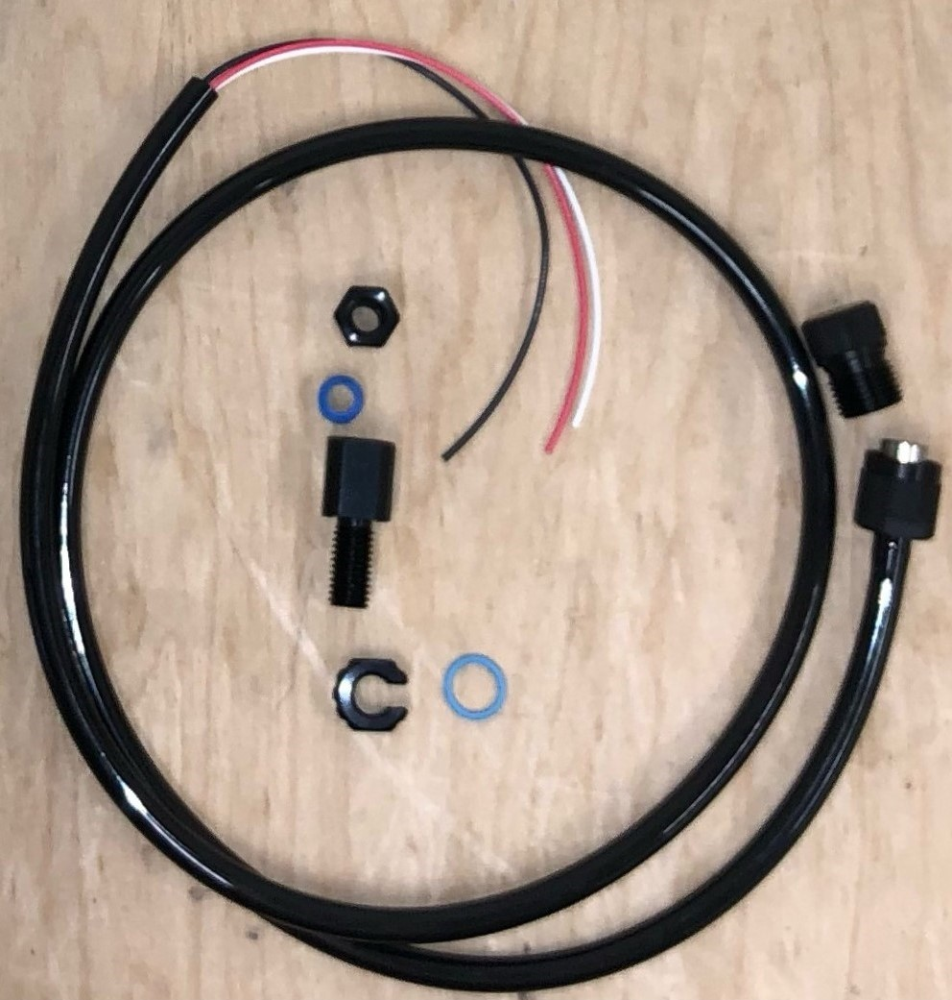 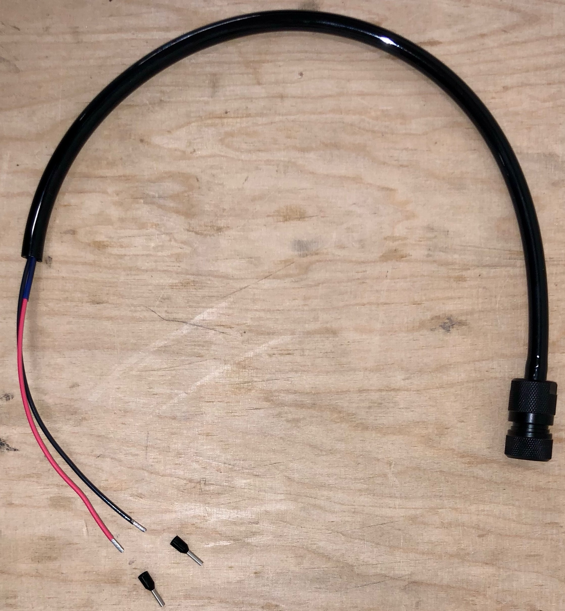 

https://bluerobotics.com/learn/wetlink-penetrator-installation-guide/

https://www.youtube.com/watch?v=vigY82tsfOI&t=2s&ab_channel=BlueRobotics

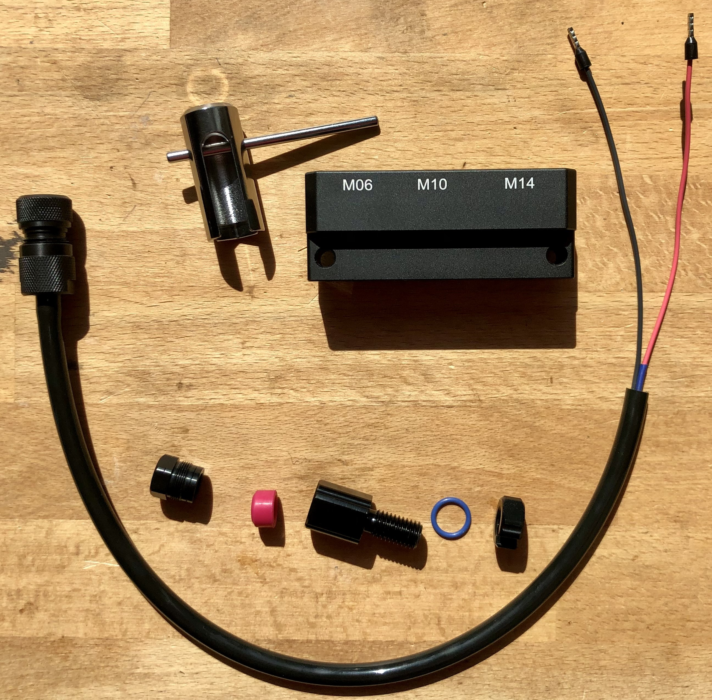 

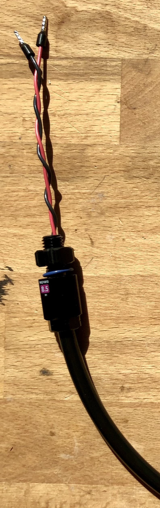 

### Installation Soft Arduino Moteur

- Installer le logiciel Arduino depuis le site https://www.arduino.cc/en/software
- Télécharger control_motor.ino depuis le github [KonkArLAb/kosmos_software](https://github.com/KonkArLab/kosmos_software/tree/dev_stereo_merge_imt)
- Placer ce fichier .ino dans un dossier nommé control_motor
- Lancer l'IDE Arduino et ouvrir control_motor.ino
- Brancher l'Arduino Nano à l'ordinateur via le port USB
- Effectuer l'installation demandée par l'IDE Arduino
- Dans l'onglet Tools, sélectionner le port COM auquel est branché l'Arduino Nano
- Dans l'onglet Tools, sélectionner la board Arduino Nano
- Dans l'onglet Tools, Manage Librairie. Taper "AccelStepper". Installer la librairie associée.
- Vérifier le code.
- Téléverser.
- (Si un message d'erreur apparaît, aller dans l'onglet `Tools` puis `Processor: ATmega328P` et choisir `ATmega328P (Old BootLoader)`. Téléverser à nouveau.)

### Impression de la vis sans fin et de la roue dentée

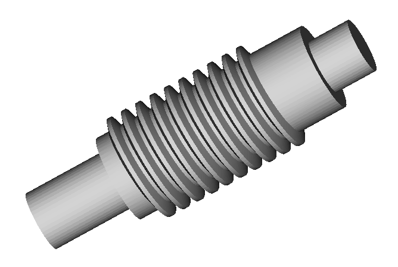 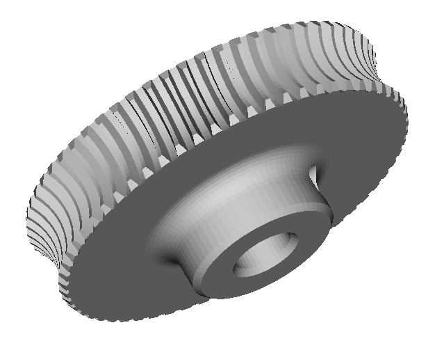

    
