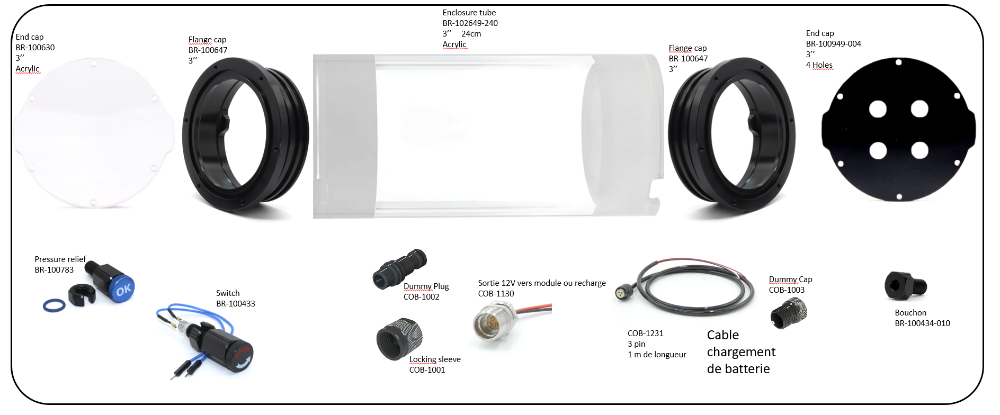

# **Nomenclature / Le sourcing**

Le sourcing est la première étape du projet et souvent la plus fastidieuse. Sourcer désigne le fait de rassembler tout ce qui sera nécéssaire pour fabriquer un **MagPI**. Ce projet demande des composants que l'on trouvera chez un grand-nombre de fournisseurs différents. De plus, ces fournisseurs peuvent différer en fonction du lieu et du moment où l'on va construire un **MagPI**.

**Attention :** Veiller à effectuer ces achats préparatoire bien avant la fabrication. En effet, certaines commandes peuvent avoir de long délais.

>[!Warning]
>Tous les liens vers les sites fournisseurs sont mis à titre indicatif.  
> **Dans le but d'une démarche low tech privilégier la récupération plutôt que l'achat.**
>
>Certains composants tels que les vis peuvent être modifiés et ne dépendent que de ce que vous avez déjà et de ce dont vous avez besoin.
>Il faut aussi noter que certaines vis sont comprises dans certains kits, dans le tableau ci-dessous vous trouverez toutes les vis nécessaire y compris celles intégrées dans les kits proposés.

**Indice substituabilité :**  
- :red_circle: : composant non modifiable
- :orange_circle: : certains paramètres du composant non modifiables
- :green_circle: : composant modifiable

## Outils & Consommables 

| Visuel | Référence | Quantité | Dénomination | Usage | Substituabilité | Tips/Conseil |
|-------|------------|----------|--------------------------|--------------------|-------------------------------|----------|
||Amazon|1|[Gaine Thermorétractable Câble Électrique](https://www.amazon.fr/dp/B08XXGNJHG?ref_=pe_111711481_1111265561_t_fed_asin_title)||||
||Amazon|1|[Aissom Pince à Sertir](https://www.amazon.fr/dp/B0CZQKQK5L?ref_=pe_111711481_1111265561_t_fed_asin_title)||||

## Caisson :

| Visuel | Référence | Quantité | Dénomination | Usage | Substituabilité | Tips/Conseil |
|-------|------------|----------|--------------------------|--------------------|-------------------------------|----------|
||BR-100630|1|Clear Acrylic End Cap (3″ Series)|Hublot|:red_circle:|Demander un devis pour ces éléments sur [ROVExpert](https://rov-expert.fr/)|
||BR-102649-240|1|Watertight Enclosure Tube: 3" Locking Series, Acrylic 240mm|Tube|:red_circle:||
||BR-100647|2|O-Ring Flange 3 inches (sealable)|Brides|:red_circle:||
||BR-100949-004|1|Aluminium End Cap with 4 Holes (3" series)|Bouchon 4 trous|:red_circle:||
||BR-100433|1|Switch|Interrupteur|:red_circle:||
||BR-100783|1|M10 Enclosure Vent and Plug|Valve pression|:red_circle:||
||BR-100434-010|1|WetLink Penetrator Blank (No Hole)|Bouchon M10|:red_circle:||
||COB-1130|1|Cobalt 3 pin Bulkhead Connector|Connecteur 3 Pin Batterie|:red_circle:||
||COB-1001|1|Cobalt Series Dummy Plug|Bouchon pour connecteur 3 Pin (partie 1)|:red_circle:||
||COB-1002|1|Cobalt Series Locking Sleeve|Bouchon pour connecteur 3 Pin (partie 2)|:red_circle:||
||COB-1231|1|Single ended Cable 3 pin|Cable recharge batterie|:red_circle:||
||COB-1003|1|Cobalt Series Dummy Cap|Bouchon pour cable recharge|:red_circle:||

## Electronique :
| Visuel | Référence | Quantité | Dénomination | Usage |Substituabilité | Tips/Conseil |
|-------|-----------|----------|--------------------------|--------------------|---------------------|----------|
||Gotronic 38575|1|[Carte Raspberry Pi 5 - 4 GB](https://www.gotronic.fr/art-carte-raspberry-pi-5-4-gb-38176.htm)|Ordinateur embarqué|:orange_circle: Une RPi4 peut aussi faire l'affaire||
||Gotronic 48810|2|[Fiche femelle 15 A XT30U-F](https://www.gotronic.fr/art-fiche-femelle-15-a-xt30u-f.htm)|Connecteurs pour la pieuvre d'alimentation|:red_circle:||
||Gotronic 48811|3|[Fiche mâle 15 A XT30U-M](https://www.gotronic.fr/art-fiche-male-15-a-xt30u-m.htm)|Connecteurs pour la pieuvre alimentation|:red_circle:||
||Amazon|1|[SUPERNIGHT Convertisseurs Power Supply Transformer DC DC](https://www.amazon.fr/Supernight-Convertisseurs-Transformer-Adjustable-Electricity/dp/B079M9CHV9)|Convertisseur 12V vers 5V 5 A |:red_circle:||

## Optique :
| Visuel | Référence | Quantité | Dénomination | Usage |Substituabilité | Tips/Conseil |
|-------|-----------|----------|--------------------------|--------------------|---------------------|----------|
||Amazon|1|[X3 1/4" Vis de Fixation 1/4 pour Appareil Photo](https://www.amazon.fr/dp/B074X453CY?ref_=pe_111711481_1111265561_t_fed_asin_title)|Vis de fixation pour la caméra Picam HQ|:red_circle:||
||IDS|1|[Objectif, Edmund, TECHSPEC UC series, 4 mm, 1/2"](https://fr.ids-imaging.com/store/lens-edmund-techspec-uc-series-4-mm-1-2.html)|Objectif 4 mm|:red_circle:||
||Gotronic 37327|1|[Caméra HQ 12 Mpx C/CS SC0261 pour Raspberry Pi](https://www.gotronic.fr/art-camera-hq-12-mpx-c-cs-sc0261-33781.htm)|Caméra embarquée|||
||||||||
||Kubii|1|[Module Caméra 5Mp Fisheye](https://www.kubii.com/fr/cameras-capteurs/2207-module-camera-5mp-grand-angle-kubii-3272496011205.html)||||

<!---
## Batterie :
| Visuel | Référence | Quantité | Dénomination | Usage |Substituabilité | Tips/Conseil |
|-------|-----------|----------|--------------------------|--------------------|---------------------|----------|
||Conrad 1499572|9|[Pile rechargeable Li-Ion Samsung 18650](https://www.conrad.fr/fr/p/pile-rechargeable-speciale-18650-samsung-s9009316342928-resiste-aux-courants-eleves-flat-top-li-ion-3-6-v-3450-mah-1-pc-1499572.html)||:orange_circle: Récupération possible||
||Gotronic 48918|1|[Cordon JST PH femelle 4 cts JST4](https://www.gotronic.fr/art-cordon-jst-ph-femelle-4-cts-jst4-22571.htm)||:orange_circle: Récupération possible mais respecter le code couleur||
||Gotronic 48810|1|[Fiche femelle 15 A XT30U-F](https://www.gotronic.fr/art-fiche-femelle-15-a-xt30u-f.htm)|Connecteurs pour la pieuvre d'alimentation|:red_circle:||
||Otronic|1|[Circuit de protection BMS 3S avec fonction d'équilibrage (OT3568)](https://www.otronic.nl/fr/circuit-de-protection-bms-3s-avec-fonction-dequili.html)||:red_circle:||
||||||||
||Amazon|1|[Plaque Nickel Bande Ruban 0,15 x 8 mm](https://www.amazon.fr/Plaque-batterie-Soudure-Compatible-Soudeur/dp/B09TT4KMLB)||:red_circle:||
||Amazon|1|[Soudeur par Points Réglable pour Batteries](https://www.amazon.fr/dp/B0DNQHWD2Q?ref_=pe_111711481_1111265561_t_fed_asin_title)||:red_circle:||
||Amazon|1|[MMOBIEL Ruban Adhésif (20mm x 30m) - Ruban Polyimide Résistant à la Chaleur ](https://www.amazon.fr/MMOBIEL-Polyimide-longueur-Antistatique-R%C3%A9sistant/dp/B07W4KWKKB)||:red_circle:||

## **1. Présentation du fichier de sourcing**

- Télécharger le fichier de sourcing en cliquant **[ici](Nomenclature_MagPI.ods)**.
- Ouvrir le fichier de sourcing à l’aide d’un tableur. Bien qu’il ait été créé avec le logiciel propriétaire Excel, il peut être ouvert sans problème avec d’autres tableurs.

### **1.1 Détails du tableau "Nomenclature MagPI"**

 - **Catégorie :** Type ou famille du composant
 - **Composant :** Nom utilisé dans la documentation
 - **Désignation fournisseur :** Nom du composant tel qu’indiqué par le fournisseur
 - **Référence fournisseur :** Identifiant ou code produit attribué par le fournisseur
 - **Fournisseur :** Nom de l’entreprise ou du site proposant le composant
 - **Détails :** Informations techniques ou précisions complémentaires
 - **Lien :** Lien menant à la fiche produit ou à la page d’achat chez le fournisseur
 - **Quantité / K :** Quantité requise pour assembler un seul MagPI
 - **Quantité :** Quantité totale nécessaire en fonction du nombre de MagPI à assembler
 - **Prix unitaire :** Coût d’un seul exemplaire du composant
 - **Prix / K :** Coût total de ce composant pour un MagPI, en tenant compte de la quantité utilisée
 - **Prix total :** Coût total de ce composant pour l’ensemble des MagPI à fabriquer

-->
