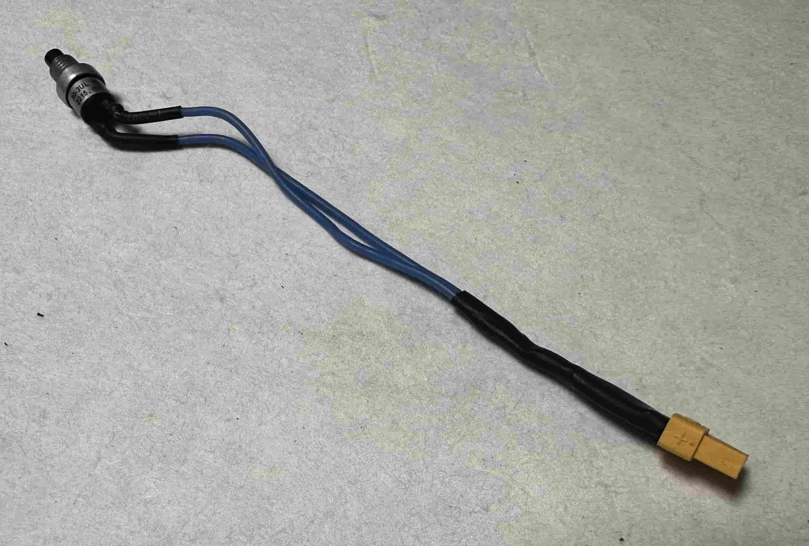
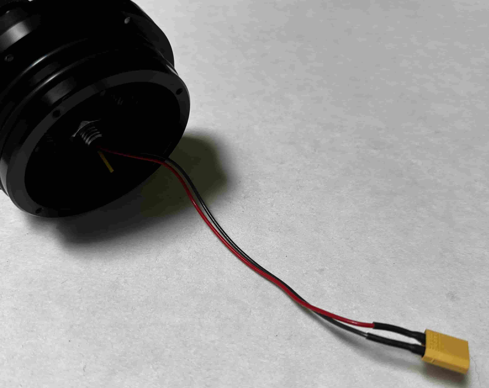
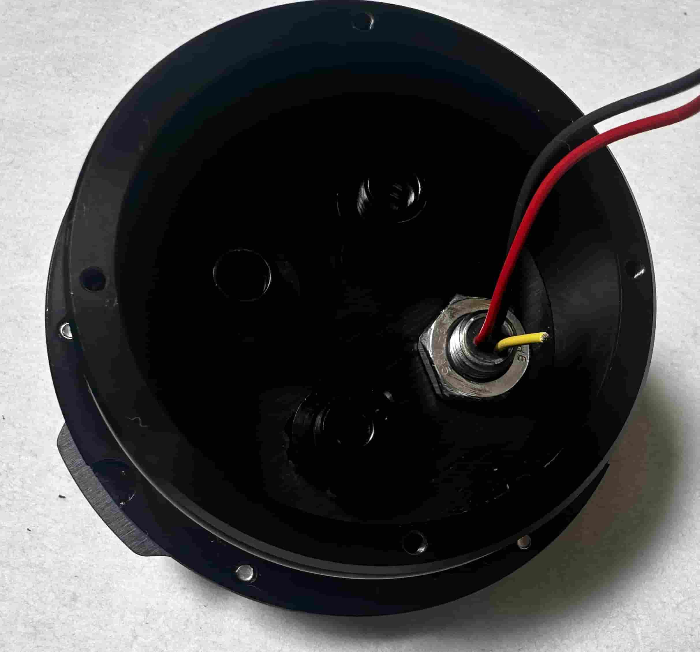
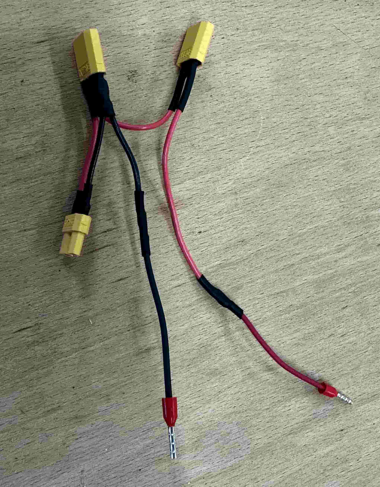
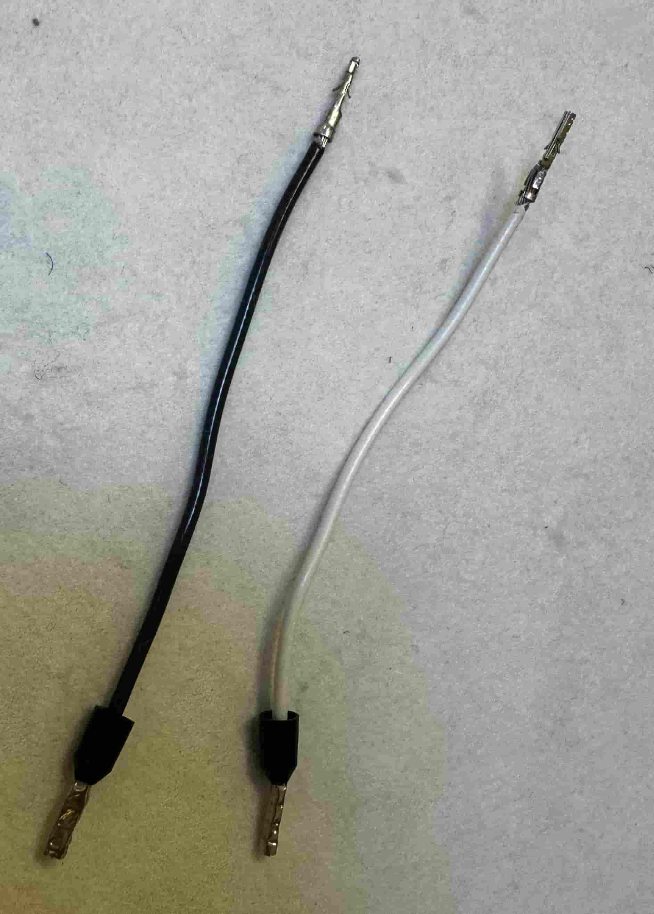

# **Réalisation de la partie câblage**

Le câblage consiste principalement à souder des connecteurs et des fils qui seront ensuite intégrés au système. Comme cette étape est très liée à l'assemblage, certaines parties renvoient à la section assemblage, et vice versa. Il est donc conseillé de lire l'assemblage avant de commencer, connaître l'assemblage permet de bien apprécier les dimensions du système et de choisir des tailles de fils adéquates.

### **Éléments nécessaires**

---

#### **Outils**

  

- **Pince à dénuder :** Réglable, comme sur l'image, pour différents types de câbles.
- **Fer à souder**
- **Bobine d'étain**
- **Source de chaleur pour gaine thermique :** Un pistolet à air chaud, un chalumeau ou un fer à souder

---

#### **Composants**

- **Switch Blue Robotics**
- **Connecteur 3 pin**
- **3 XT30 mâles, 2 XT30 femelles**
- **Bobines de câble noir, rouge et blanc**
- **Gaines thermorétractables**
- **4 cosses de deux couleurs différentes, E1008/E1508**
- **2 Contact à sertir femelle**

## Vue d'ensemble

Le câblage se découpe en 4 parties :

 - **Switch en bleu**
 - **Chargeur en rouge**
 - **Connecteur "pieuvre" en jaune**
 - **Alimentation du raspberry en vert**

---

### Switch

La partie solide du bout des câbles bleu est coupée et soudée directement sur les pattes du switch pour gagner de la place et réduire le risque qu'il casse.
Les deux câbles sont soudés sur un connecteur XT30 **femelle**.

---

### Chargeur

**⚠️ Attention:** Il faut que le connecteur 3 pin correspondant au chargeur de notre système soit d'abord installé sur la partie hermétique avant d'y souder un connecteur XT30 **mâle**.

Le câble jaune est coupé, il n'est pas utilisé dans notre cas et serait juste encombrant.

---

### Connecteur pieuvre

Cette partie fait le lien entre nos éléments, il faut faire particulièrement attention à la taille des câbles entre les connecteurs, pas trop long pour avoir assez de place, pas trop court au risque de ne pas pouvoir atteindre le convertisseur par exemple. Comme dit dans la partie switch, bien choisir le connecteur complémentaire pour le switch

---

### Alimentation raspberry

Ces câbles connectent la sortie 5V du convertisseur vers la raspberry, on utilise les connecteur à sertir pour "brancher" les câbles sur les pins de la raspberry. Rajouter une gaine thermo sur ces connecteurs est une bonne idée pour les renforcer.
