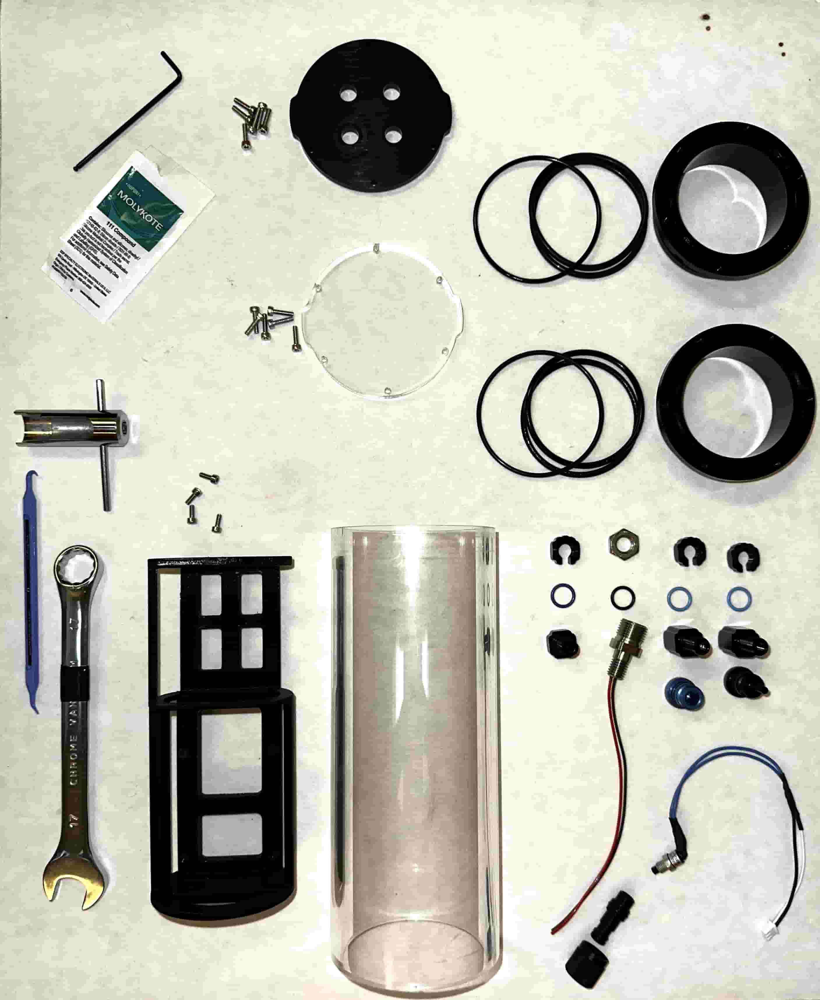

# **Assemblage du système**

Cette partie comprend le montage de la partie hermétique puis l'installation de tous les composants au sein de cette dernière.

## Vue d'ensemble

||
|:--:|
|*Assemblage final du caisson*|
---

### **Éléments nécessaires**

#### **Outils**

- **Clé de 17 et Clé WetLink M10**
- **Clé allen, tournevis plat/cruciforme**
- **O-ring pick**

---

### Caisson hermétique

#### Composants

---

On installe d'abord le switch, port de charge, vis de purge et bouchon sur le côté en aluminium.

 

Le constructeur des composants hermétique propose un tutoriel expliquant l'assemblage des bouchons du caisson avec graissage des joints : **[ici](https://youtu.be/G6PqEsKjxHM)**.

On obtient donc nos deux flanges finies.

---

### Assemblage des composants

- **Batterie**
- **Connecteur pieuvre**
- **Raspberry Pi**
- **Convertisseur 12V-5V**
- **Camera et sa nappe**
- **Câbles d'alimentation du Raspberry**
- **Partie hermétique**
- **Support 3D**

#### Convertisseur

Le convertisseur est fixé sur ses supports.

#### Raspberry Pi

La carte Raspberry Pi est fixée, la nappe de la caméra est installée au préalable pour plus de facilité.

#### Batterie

La batterie est installé et fixé avec un serre flex, qui passe dans les encoches du support. Les câbles de la batterie passent sous la carte raspberry. Les câbles de charge et du switch sont aussi coincé par le serre flex et passent eux aussi sous la carte.

#### Câblage

La pieuvre est connectée aux différents éléments, en respectant bien le schéma de câblage.

#### Alimentation Raspberry

Les câbles de la pieuvre sont connectés au convertisseur, les câbles d'alimentation de la rapsberry sont branchés sur les pin 1 et 3 de la carte.

#### Caméra

La nappe de la caméra est branchée.

---

Ainsi notre système est assemblé et prêt à être testé.

