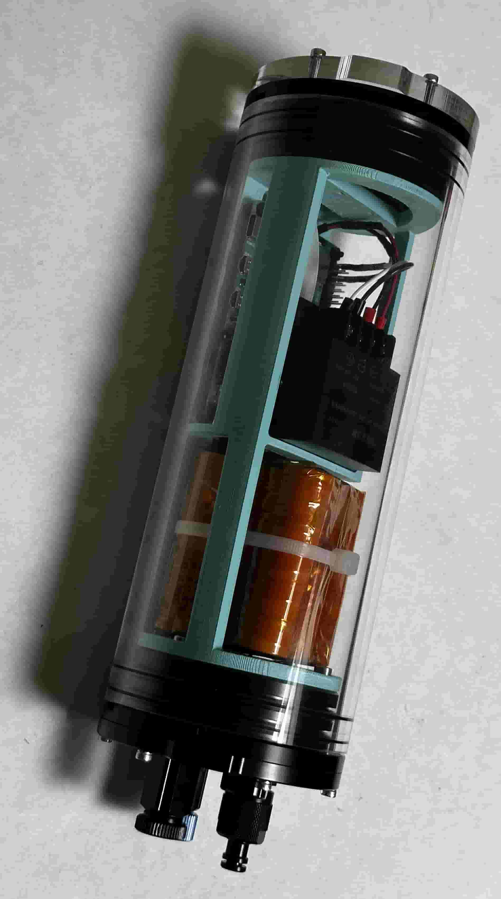
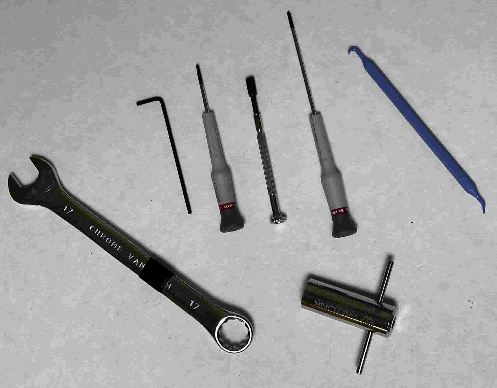
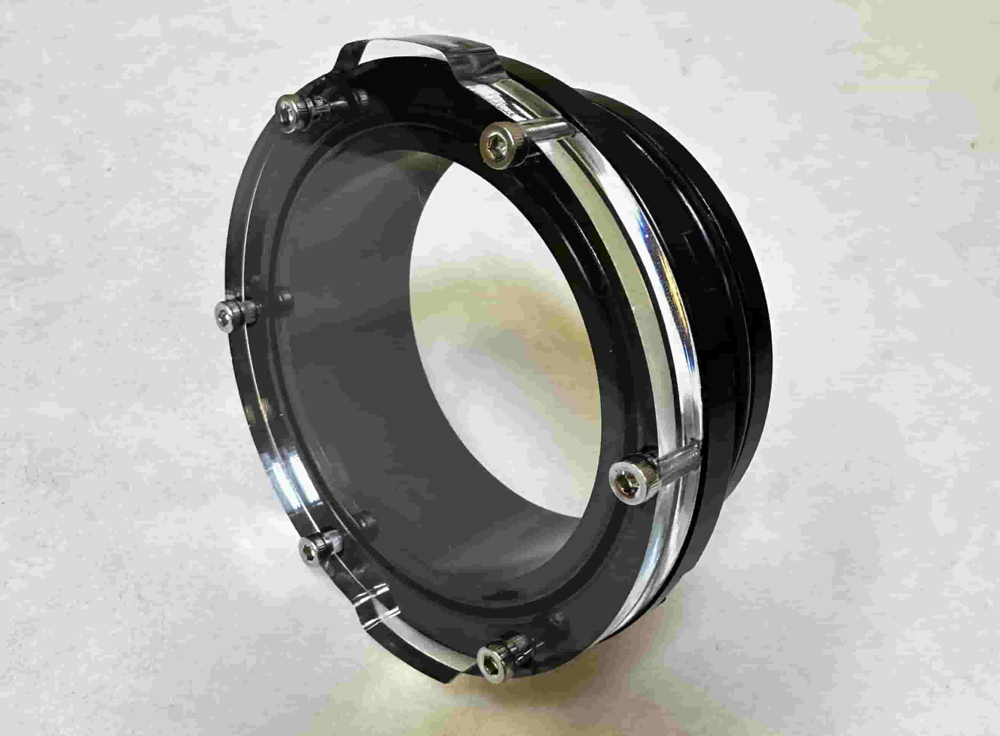
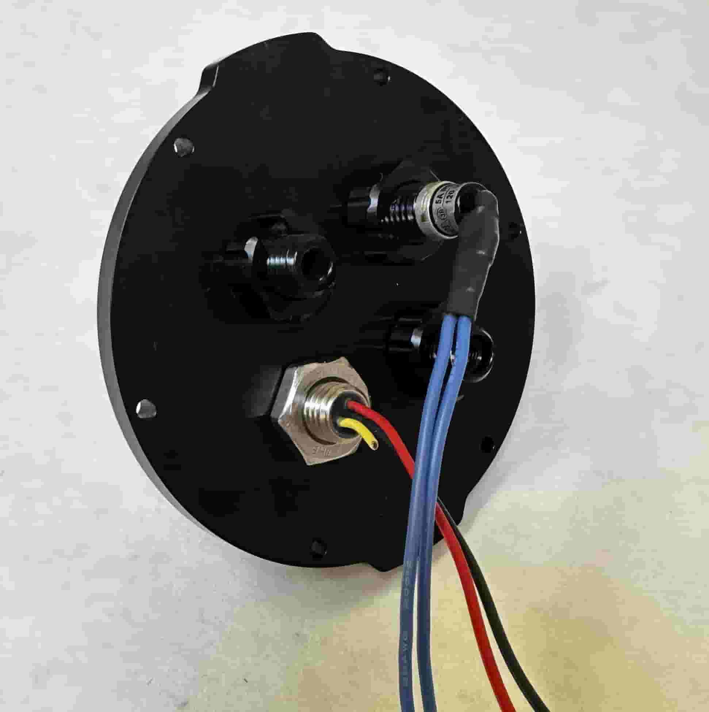
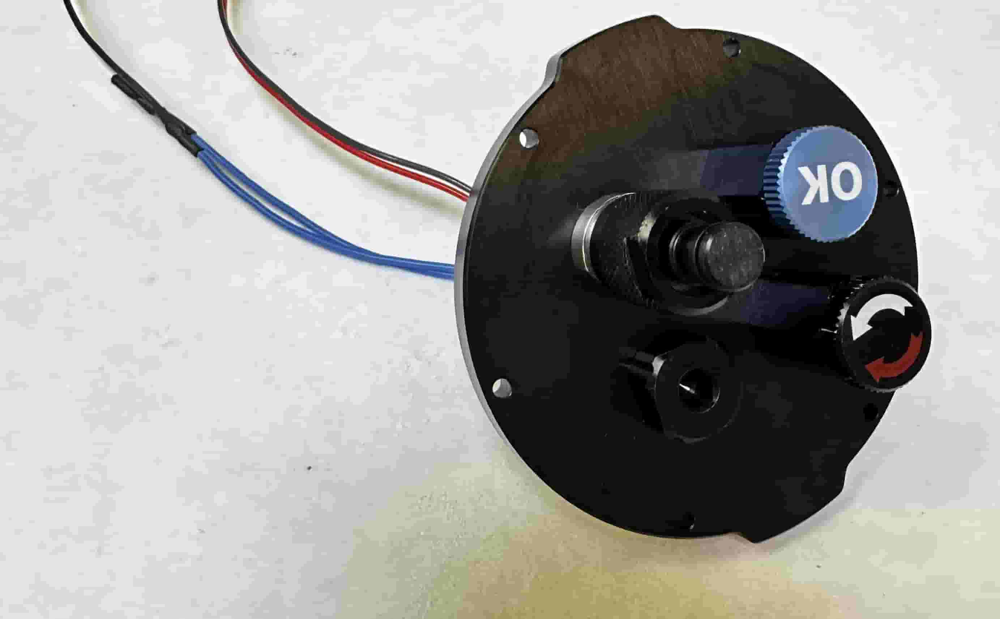
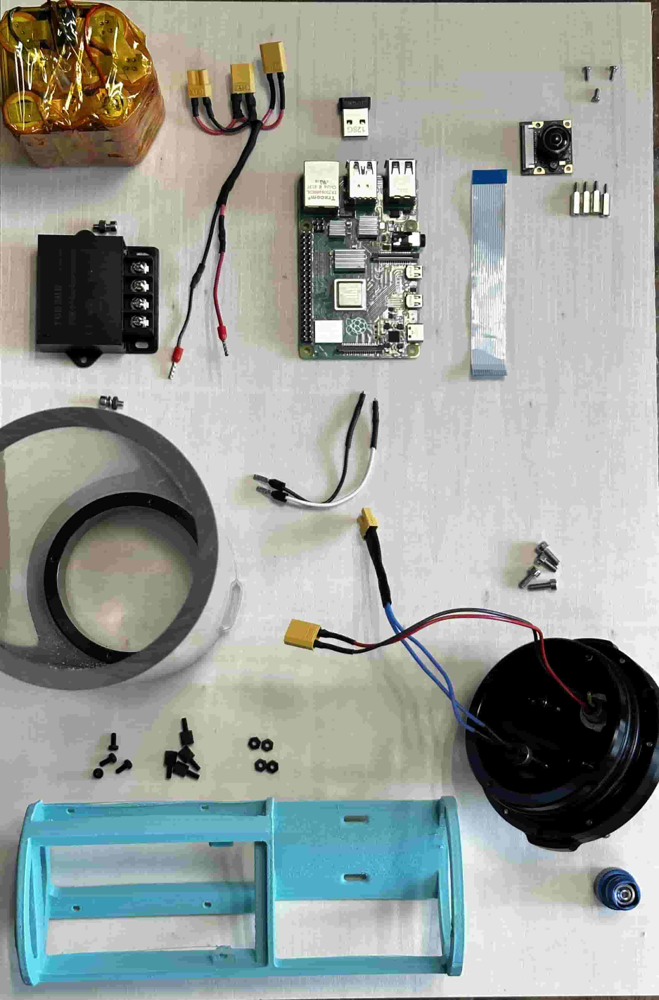
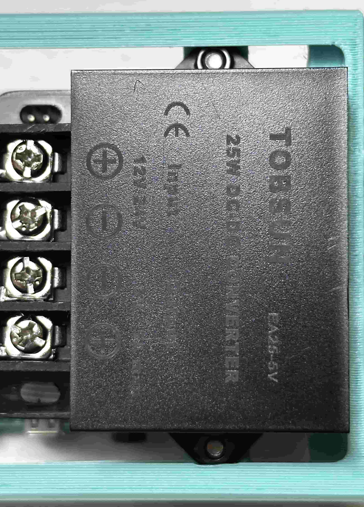
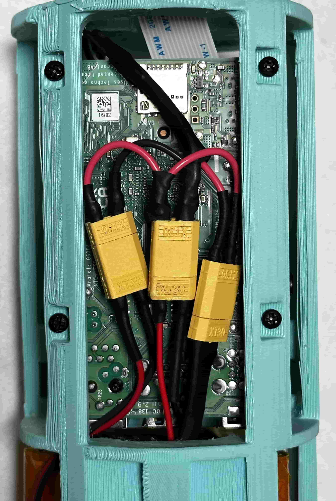
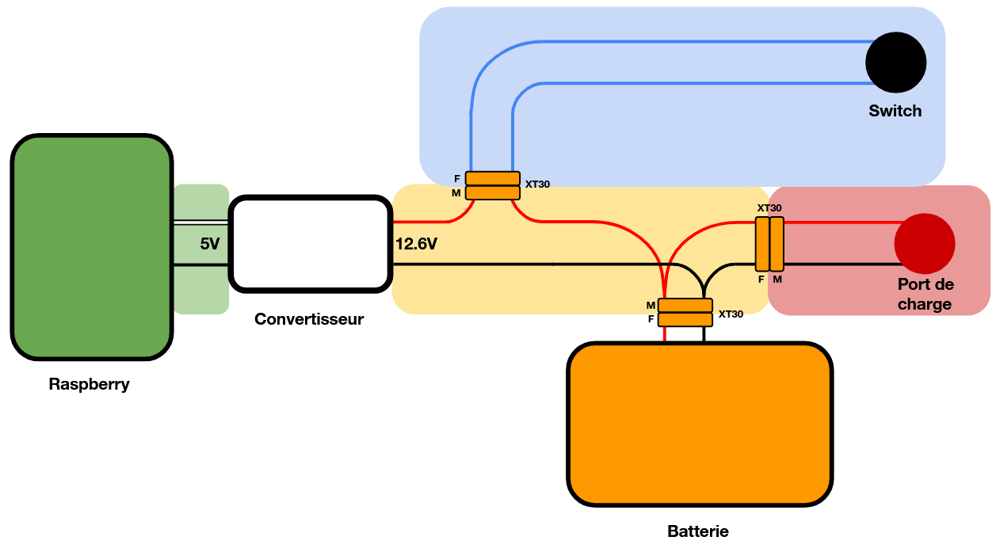
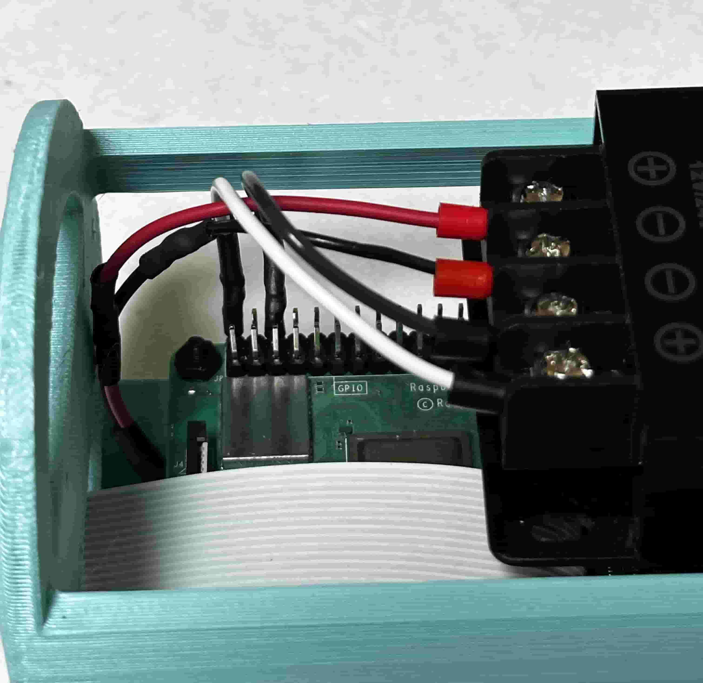

# **Contexte**

# **Assemblage du système**

Cette partie détaille le montage de la partie étanchétité puis l'installation de tous les composants au sein de cette dernière. L'objectif est d'obtenir le système suivant :

||
|:--:|
|*Caisson assemblé*|

## **Outils nécessaires**

- **Clé de 17 et Clé WetLink M10**
- **Clé allen, tournevis plat/cruciforme**
- **O-ring pick**

## Assemblage du caisson étanche

Le constructeur des composants hermétique propose un tutoriel expliquant l'assemblage des bouchons du caisson avec graissage des joints : **[ici](https://youtu.be/G6PqEsKjxHM)**.

### Partie Hublot

Suivre le tutoriel précédent pour réaliser la partie "hublot"

### Partie connecteurs

On installe d'abord le switch, le port de charge 3 pin, la vis de purge et enfin le bouchon sur le côté en aluminium.

 

Suivre le tutoriel pour assembler le bouchon 4 trous avec les connecteurs avec le flange. 

### Fabrication des brides de sécurité

Dévisser la vis de purge puis assembler les deux flanges et le tube en vérifiant que les détrompeurs sont bien à leur place. Insérer les deux brides de sécurité dans la gorge des deux flanges. Couper ces brides de sorte à ne laisser qu'1 cm dépasser. Mettre sur ce cm la bague et la serrer fermement.  

## Assemblage de l'électronique interne

### Composants nécessaires

- **Batterie**
- **Connecteur pieuvre**
- **Raspberry Pi**
- **Convertisseur 12V-5V**
- **Camera et sa nappe**
- **Câbles d'alimentation du Raspberry**
- **Support 3D**

### Assemblage

Fixer la flange connecteurs sur le support 3D.

Fixer ensuite le convertisseur :

Fixer la Raspberry Pi sur le support 3D. Y connecter la nappe caméra :

La batterie est ensuite installé et fixée avec un serre flex, qui passe dans les encoches du support. Les câbles de la batterie passent sous la carte raspberry. Les câbles de charge et du switch sont aussi coincés par le serre flex et passent eux aussi sous la carte.

### Cablage

La pieuvre est connectée aux différents éléments, en respectant bien le schéma de câblage.

  

Les câbles sertis de la pieuvre sont connectés au convertisseur, les câbles d'alimentation de la rapsberry sont branchés sur les pin 1 et 3 de la carte.

### Caméra
Fixer les entretoises sur le support 3D puis y visser la carte caméra. Brancher enfin la nappe.

## Installation du logiciel MagPi

Suivre les instructions de la [page web](https://github.com/KonkArLab/kosmos_software/blob/main/README.md)

Insérer enfin l'électronique dans le caisson étanche puis placer la flange hublot. Placer les brides et revisser la vis de purge.
Le système est prêt à être utilisé.

# Mode d'emploi

